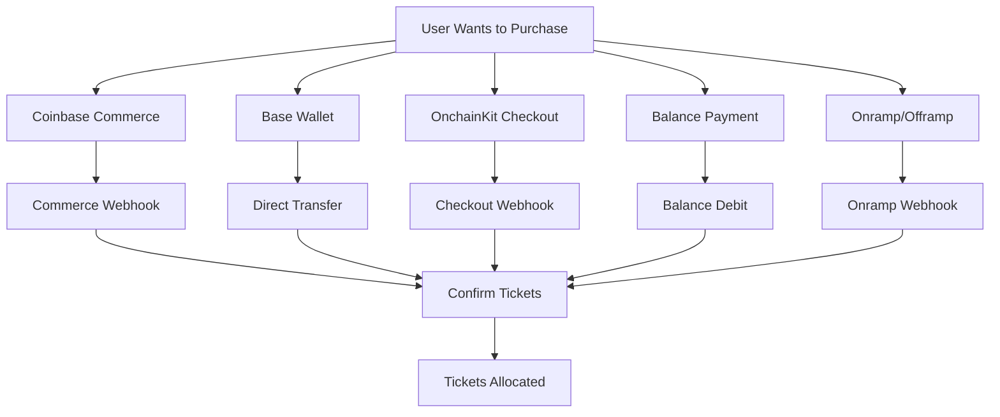
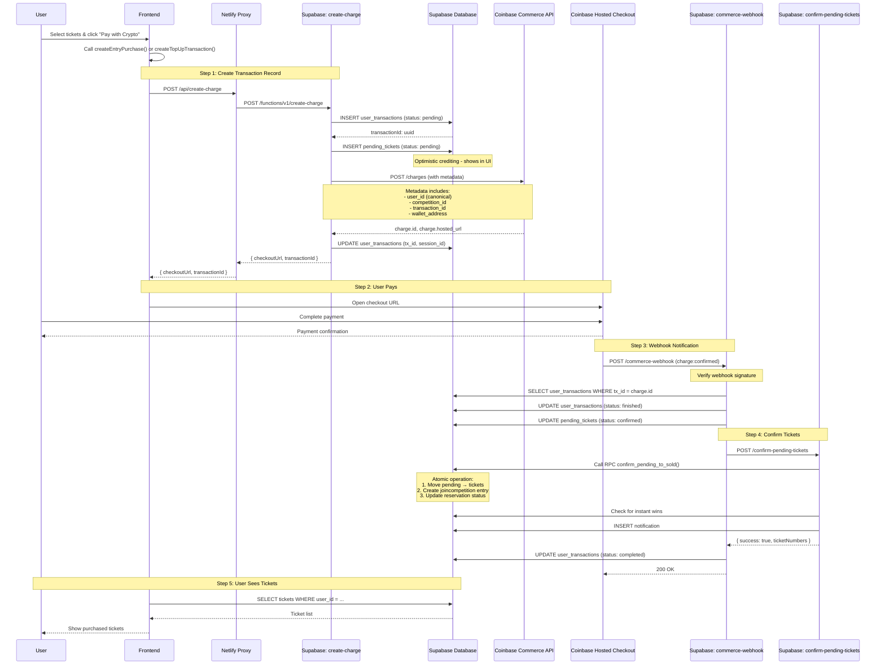
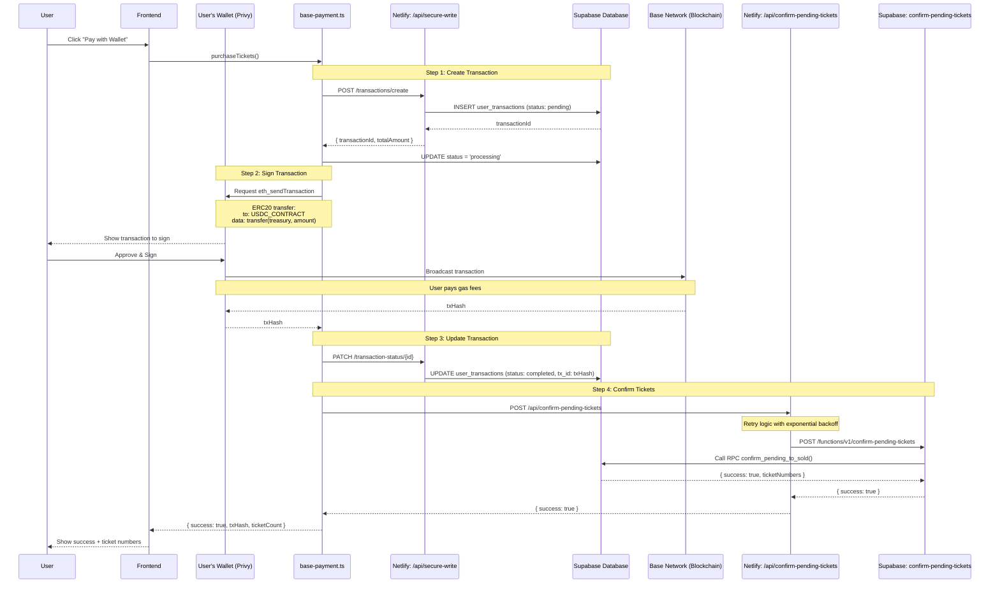
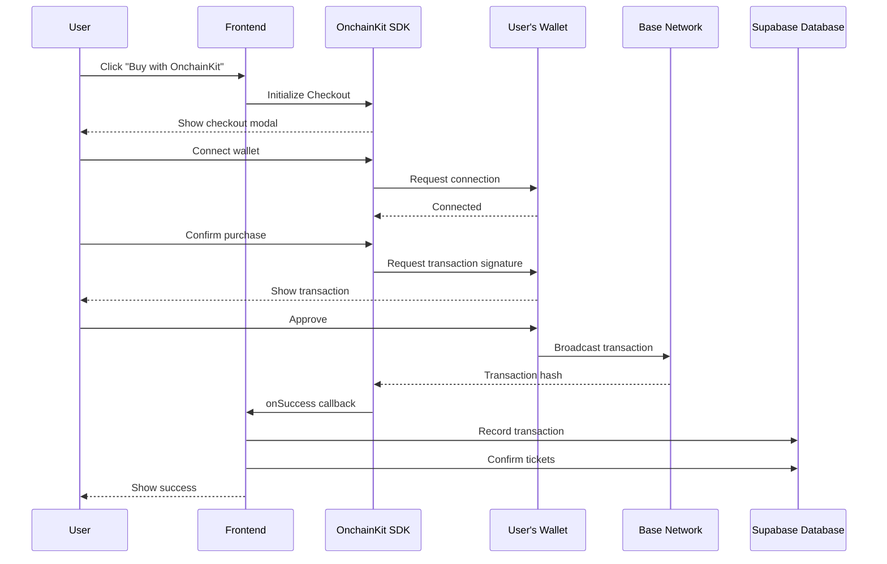
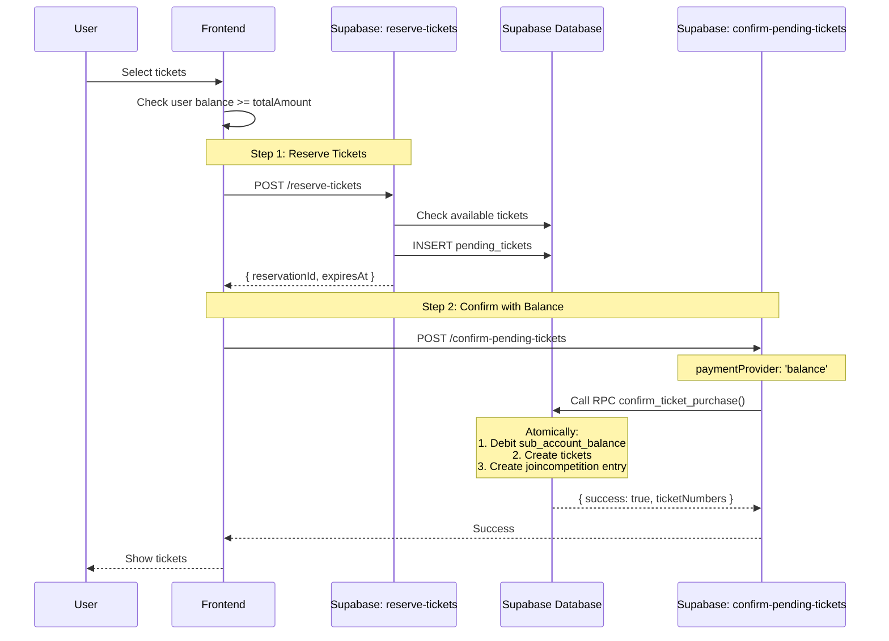
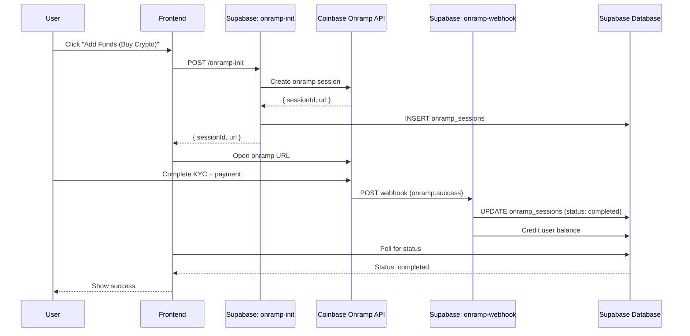
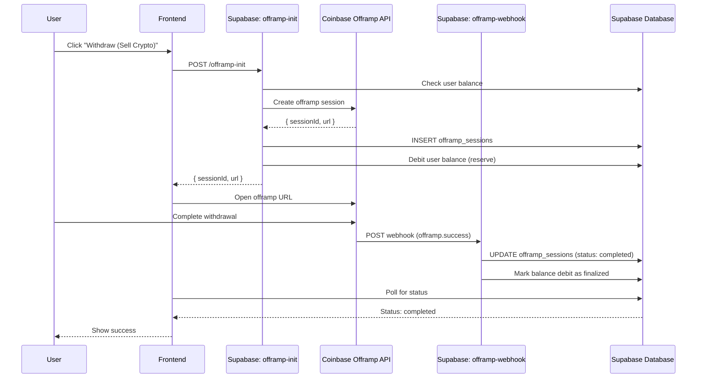
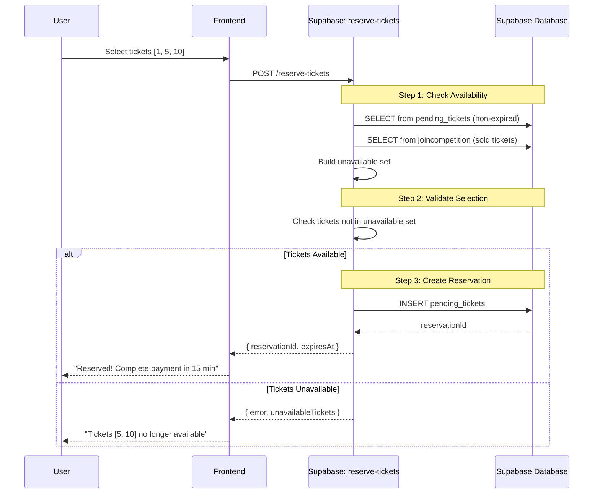
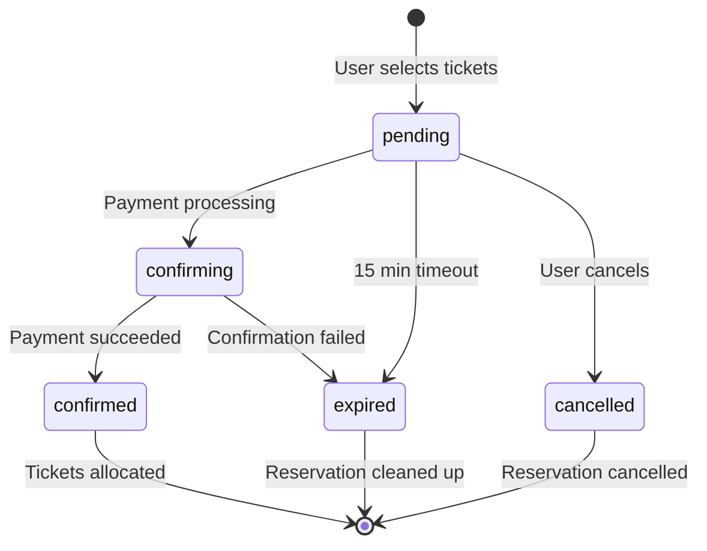
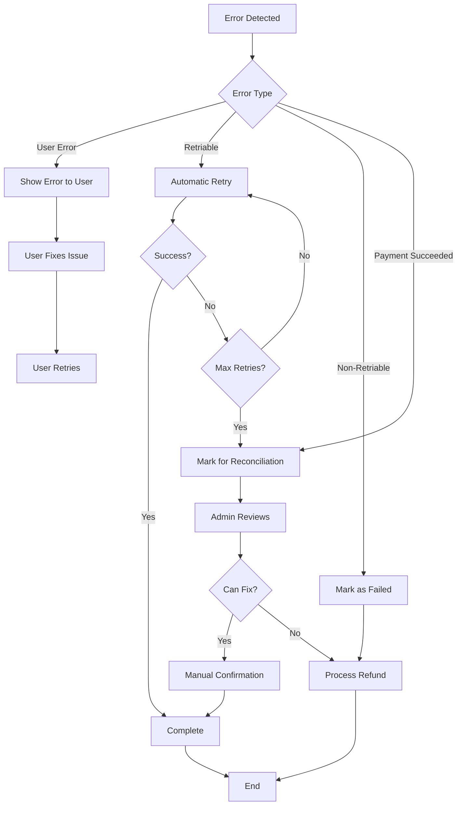

# Complete Payment Architecture Documentation

**Last Updated:** January 20, 2026  
**Version:** 1.0

---

## Table of Contents

1. [Executive Summary](#executive-summary)
2. [Payment Methods Overview](#payment-methods-overview)
3. [Coinbase Commerce Payment Flow](#coinbase-commerce-payment-flow)
4. [Base Wallet Payment Flow](#base-wallet-payment-flow)
5. [OnchainKit Checkout Flow](#onchainkit-checkout-flow)
6. [Balance Payment Flow](#balance-payment-flow)
7. [Coinbase Onramp/Offramp Flows](#coinbase-onrampofframp-flows)
8. [Ticket Reservation System](#ticket-reservation-system)
9. [Database Architecture](#database-architecture)
10. [Webhook Architecture](#webhook-architecture)
11. [Error Handling & Recovery](#error-handling--recovery)
12. [Security Measures](#security-measures)
13. [Monitoring & Observability](#monitoring--observability)
14. [Known Issues & Fixes](#known-issues--fixes)
15. [API Reference](#api-reference)

---

## Executive Summary

The Prize.io payment system supports **5 primary payment methods** for ticket purchases and wallet top-ups:

1. **Coinbase Commerce** - Dynamic crypto payments with hosted checkout
2. **Base Wallet (Privy)** - Direct USDC transfers on Base network
3. **OnchainKit Checkout** - One-click crypto checkout using OnchainKit SDK
4. **Balance Payments** - Pay from user's credited site balance
5. **Coinbase Onramp/Offramp** - Fiat to crypto conversion

### Architecture Principles

- **Optimistic Crediting**: Show pending balances/tickets immediately for better UX
- **Webhook-Driven Confirmation**: Final confirmation happens via payment provider webhooks
- **Atomic Operations**: Use database RPCs for race-condition-free confirmations
- **Retry Logic**: Exponential backoff for transient failures
- **Idempotency**: Safe to retry operations without duplicate charges

---

## Payment Methods Overview



### Payment Method Comparison

| Method | Speed | User Onboarding | Gas Fees | Best For |
|--------|-------|-----------------|----------|----------|
| Coinbase Commerce | Medium (webhook) | Low - hosted checkout | None (covered by Coinbase) | First-time crypto users |
| Base Wallet | Fast (immediate) | Medium - wallet connection | Low (Base L2) | Experienced crypto users |
| OnchainKit | Fast (immediate) | Low - one-click | Low (Base L2) | Quick purchases |
| Balance Payment | Instant | None - already funded | None | Repeat users |
| Onramp/Offramp | Slow (fiat conversion) | Medium - KYC required | Varies | Non-crypto users |

---

## Coinbase Commerce Payment Flow

### Overview

Coinbase Commerce provides a hosted checkout experience where users pay with cryptocurrency, and webhooks notify our backend when payments are confirmed.

### Flow Diagram



### Detailed Steps

#### Step 1: Create Charge

**File:** `src/lib/coinbase-commerce.ts` → `CoinbaseCommerceService.createEntryPurchase()`

```javascript
// Client-side code
const result = await CoinbaseCommerceService.createEntryPurchase(
  userId,           // Canonical user ID (prize:pid:0x...)
  competitionId,    // Competition UUID
  entryPrice,       // Price per ticket
  entryCount,       // Number of tickets
  selectedTickets,  // Array of ticket numbers
  reservationId     // Optional: pending_tickets.id
);
// Returns: { transactionId, checkoutUrl, totalAmount, entryCount }
```

**Flow:**
1. Validates inputs (userId, competitionId, entryPrice, entryCount)
2. Creates `pending_tickets` record (optimistic crediting)
3. Calls `/api/create-charge` (Netlify proxy)
4. Netlify proxy calls Supabase Edge Function `create-charge`

**File:** `supabase/functions/create-charge/index.ts`

```javascript
// Server-side edge function
const chargePayload = {
  name: `Competition Entry: ${entryCount} tickets`,
  description: `Purchase ${entryCount} entry tickets`,
  pricing_type: "fixed_price",
  local_price: { amount: totalAmount.toFixed(2), currency: "USD" },
  metadata: {
    user_id: canonicalUserId,           // prize:pid:0x...
    wallet_address: walletAddress,      // 0x... (for smart wallet resolution)
    competition_id: competitionId,
    entry_count: entryCount,
    reservation_id: reservationId,
    transaction_id: transactionId,
    type: 'entry',
    selected_tickets: JSON.stringify(selectedTickets)
  }
};
```

**Database Changes:**
```sql
-- Step 1a: Create transaction record
INSERT INTO user_transactions (
  id,                 -- UUID
  user_id,           -- Canonical format: prize:pid:0x...
  competition_id,    -- UUID (NULL for top-ups)
  amount,            -- Total amount in USD
  status,            -- 'pending'
  payment_provider,  -- 'coinbase'
  ticket_count,      -- Number of tickets
  created_at
) VALUES (...);

-- Step 1b: Create pending ticket record (optimistic)
INSERT INTO pending_tickets (
  id,                -- UUID (reservationId)
  user_id,          -- Canonical user ID
  competition_id,   
  ticket_numbers,   -- ARRAY of integers
  ticket_count,
  ticket_price,
  total_amount,
  status,           -- 'pending'
  session_id,       -- transactionId
  expires_at,       -- NOW() + 30 minutes
  created_at
) VALUES (...);
```

**Coinbase Commerce API Call:**
```bash
POST https://api.commerce.coinbase.com/charges
Headers:
  X-CC-Api-Key: <COINBASE_COMMERCE_API_KEY>
  X-CC-Version: 2018-03-22
  Content-Type: application/json

Body: { chargePayload }

Response: {
  "data": {
    "id": "CHARGE_ID",
    "code": "CHARGE_CODE",
    "hosted_url": "https://commerce.coinbase.com/checkout/CHARGE_CODE",
    ...
  }
}
```

**Update Transaction:**
```sql
UPDATE user_transactions
SET 
  tx_id = 'CHARGE_ID',
  session_id = 'CHARGE_CODE',
  payment_status = 'waiting'
WHERE id = transactionId;
```

#### Step 2: User Completes Payment

User is redirected to Coinbase Commerce hosted checkout page where they:
1. Select cryptocurrency (BTC, ETH, USDC, etc.)
2. Send payment from their wallet
3. Wait for blockchain confirmation
4. See success message

#### Step 3: Webhook Receives Confirmation

**File:** `supabase/functions/commerce-webhook/index.ts`

**Webhook Events:**
- `charge:pending` - Payment initiated
- `charge:confirmed` - Payment confirmed on blockchain ✅
- `charge:failed` - Payment failed
- `charge:delayed` - Payment delayed
- `charge:resolved` - Payment issue resolved

**Webhook URL:** `https://mthwfldcjvpxjtmrqkqm.supabase.co/functions/v1/commerce-webhook`

**Signature Verification:**
```javascript
// Verify HMAC-SHA256 signature
const signature = req.headers.get("X-CC-Webhook-Signature");
const secret = Deno.env.get("COINBASE_COMMERCE_WEBHOOK_SECRET");

const isValid = await verifyWebhookSignature(
  rawBody,    // Raw request body
  signature,  // Header value
  secret      // Webhook secret from Coinbase
);

if (!isValid) {
  return Response(401, "Invalid signature");
}
```

**Process charge:confirmed:**

```javascript
// 1. Log webhook event
INSERT INTO payment_webhook_events (
  provider: 'coinbase_commerce',
  event_type: 'charge:confirmed',
  charge_id: eventData.id,
  user_id: metadata.user_id,
  competition_id: metadata.competition_id,
  payload: fullPayload
);

// 2. Find transaction
SELECT * FROM user_transactions
WHERE id = metadata.transaction_id
   OR tx_id = eventData.id;

// 3. Check if already processed (idempotency)
IF transaction.status IN ('finished', 'completed') THEN
  RETURN 200 "Already processed";
END IF;

// 4. Update transaction status
UPDATE user_transactions
SET 
  status = 'finished',
  payment_status = 'confirmed',
  completed_at = NOW()
WHERE id = transaction.id;

// 5. Update pending_tickets
UPDATE pending_tickets
SET 
  status = 'confirmed',
  transaction_hash = eventData.id,
  confirmed_at = NOW()
WHERE id = reservationId OR session_id = transactionId;

// 6. Call confirm-pending-tickets function
POST /functions/v1/confirm-pending-tickets {
  reservationId,
  userId,
  competitionId,
  transactionHash,
  paymentProvider: 'coinbase_commerce'
}
```

#### Step 4: Confirm Tickets

**File:** `supabase/functions/confirm-pending-tickets/index.ts`

**Atomic Conversion via RPC:**

```sql
-- RPC: confirm_pending_to_sold()
-- Ensures no race conditions or duplicate tickets
SELECT * FROM confirm_pending_to_sold(
  p_reservation_id := reservationId,
  p_transaction_hash := transactionHash,
  p_payment_provider := 'coinbase_commerce',
  p_wallet_address := walletAddress
);

-- RPC performs atomically:
-- 1. Lock pending_tickets row (status = 'confirming')
-- 2. Verify not expired
-- 3. Create individual ticket records
-- 4. Create joincompetition entry
-- 5. Update pending_tickets (status = 'confirmed')
-- 6. Return ticket numbers
```

**Check Instant Wins:**
```sql
SELECT * FROM Prize_Instantprizes
WHERE competitionId = competitionId
  AND winningTicket IN (ticketNumbers)
  AND winningWalletAddress IS NULL;

-- If found, claim prize:
UPDATE Prize_Instantprizes
SET 
  winningWalletAddress = walletAddress,
  winningUserId = userId,
  wonAt = NOW()
WHERE UID = prize.UID;
```

**Create Notification:**
```sql
INSERT INTO notifications (
  user_id,
  type,
  title,
  message,
  data,
  read,
  created_at
) VALUES (
  userId,
  CASE 
    WHEN instantWins.length > 0 THEN 'instant_win'
    ELSE 'purchase_confirmed'
  END,
  ...
);
```

#### Step 5: Handle Top-Ups

For wallet top-ups (competition_id IS NULL):

```javascript
// 1. Credit user balance with retry logic
FOR attempt IN 1..3 LOOP
  TRY
    SELECT * FROM credit_sub_account_balance(
      p_canonical_user_id := userId,
      p_amount := topUpAmount,
      p_currency := 'USD'
    );
    
    IF success THEN EXIT; END IF;
    
  CATCH
    WAIT exponential_backoff(attempt);
  END;
END LOOP;

// 2. Fallback: Direct table update
IF NOT success THEN
  UPDATE sub_account_balances
  SET 
    available_balance = available_balance + topUpAmount,
    last_updated = NOW()
  WHERE canonical_user_id = userId;
END IF;

// 3. Update transaction
UPDATE user_transactions
SET 
  status = 'completed',
  wallet_credited = true,
  credit_synced = true
WHERE id = transactionId;

// 4. Confirm pending_topups
UPDATE pending_topups
SET 
  status = 'confirmed',
  confirmed_at = NOW()
WHERE session_id = transactionId;
```

### Error Scenarios

#### Error 1: Webhook Not Configured

**Symptom:** Payment completes but tickets never appear

**Root Cause:** Coinbase Commerce webhook URL not configured

**Detection:**
```sql
SELECT COUNT(*) FROM payment_webhook_events
WHERE provider = 'coinbase_commerce'
  AND created_at > NOW() - INTERVAL '24 hours';
-- If 0 and payments exist → webhook not configured
```

**Fix:**
1. Go to [Coinbase Commerce Dashboard](https://commerce.coinbase.com/dashboard/settings)
2. Navigate to Settings → Webhooks
3. Add endpoint: `https://mthwfldcjvpxjtmrqkqm.supabase.co/functions/v1/commerce-webhook`
4. Select events: `charge:confirmed`, `charge:failed`, `charge:pending`
5. Copy webhook secret
6. Add to Supabase: Edge Functions → Secrets → `COINBASE_COMMERCE_WEBHOOK_SECRET`

#### Error 2: Signature Verification Failed

**Symptom:** Webhook logs show "Invalid signature"

**Root Cause:** Webhook secret mismatch

**Fix:**
```bash
# Get webhook secret from Coinbase Commerce Dashboard
# Update in Supabase
supabase secrets set COINBASE_COMMERCE_WEBHOOK_SECRET="your_secret_here"
```

#### Error 3: Transaction Not Found

**Symptom:** Webhook receives event but can't find transaction

**Root Cause:** Metadata not passed correctly or user ID format mismatch

**Fix:** Already implemented - webhook tries multiple lookups:
1. By `metadata.transaction_id`
2. By `charge.id` (tx_id column)
3. By canonical user ID matching

#### Error 4: Tickets Already Sold

**Symptom:** Payment succeeds but tickets can't be allocated

**Root Cause:** Competition sold out or tickets taken by another user

**Handling:**
```javascript
// Mark transaction for reconciliation
UPDATE user_transactions
SET status = 'needs_reconciliation'
WHERE id = transactionId;

// Admin must manually:
// 1. Refund customer OR
// 2. Allocate different tickets
```

#### Error 5: Smart Wallet Resolution

**Symptom:** User paid with smart wallet but tickets go to wrong user

**Fix:** Already implemented - webhook resolves smart wallets:
```javascript
// Check if wallet is a smart contract
SELECT * FROM canonical_users
WHERE smart_wallet_address = walletAddress;

// If found, use parent wallet_address instead
IF (parentUser) {
  walletAddress = parentUser.wallet_address;
  userId = parentUser.canonical_user_id;
}
```

### Retry Logic

**Ticket Confirmation Retries:**
```javascript
// In commerce-webhook/index.ts
const MAX_RETRIES = 3;
for (let attempt = 1; attempt <= MAX_RETRIES; attempt++) {
  try {
    const response = await fetch(confirmPendingTicketsUrl, {
      method: 'POST',
      body: JSON.stringify(confirmPayload)
    });
    
    if (response.ok && result.success) {
      break; // Success!
    }
  } catch (error) {
    if (attempt < MAX_RETRIES) {
      await sleep(Math.pow(2, attempt - 1) * 1000); // Exponential backoff
    }
  }
}

// If all retries fail
UPDATE user_transactions
SET status = 'needs_reconciliation'
WHERE id = transactionId;
```

**Balance Credit Retries:**
```javascript
// In commerce-webhook/index.ts (top-up handling)
for (let attempt = 1; attempt <= 3; attempt++) {
  try {
    const { data, error } = await supabase.rpc('credit_sub_account_balance', {
      p_canonical_user_id: userId,
      p_amount: topUpAmount,
      p_currency: 'USD'
    });
    
    if (!error && data?.success) {
      break; // Success!
    }
  } catch (error) {
    await sleep(Math.pow(2, attempt - 1) * 1000);
  }
}

// Fallback: Direct table update
if (!creditSuccess) {
  // Insert or update balance record directly
  INSERT INTO sub_account_balances (...)
  ON CONFLICT (canonical_user_id, currency) DO UPDATE ...;
}
```

### Monitoring Queries

**Recent Transactions:**
```sql
SELECT 
  id,
  user_id,
  competition_id,
  amount,
  status,
  payment_status,
  tx_id,
  created_at,
  completed_at,
  EXTRACT(EPOCH FROM (completed_at - created_at))/60 as minutes_to_complete
FROM user_transactions
WHERE payment_provider = 'coinbase'
  AND created_at > NOW() - INTERVAL '24 hours'
ORDER BY created_at DESC;
```

**Stuck Payments:**
```sql
SELECT 
  ut.id,
  ut.user_id,
  ut.competition_id,
  ut.amount,
  ut.status,
  ut.created_at,
  EXTRACT(EPOCH FROM (NOW() - ut.created_at))/60 as minutes_stuck,
  pt.status as pending_status
FROM user_transactions ut
LEFT JOIN pending_tickets pt ON pt.session_id = ut.id
WHERE ut.payment_provider = 'coinbase'
  AND ut.status IN ('pending', 'waiting', 'processing')
  AND ut.created_at < NOW() - INTERVAL '30 minutes'
ORDER BY ut.created_at DESC;
```

**Webhook Health:**
```sql
SELECT 
  DATE_TRUNC('hour', created_at) as hour,
  COUNT(*) as webhook_count,
  COUNT(*) FILTER (WHERE status = 200) as successful,
  COUNT(*) FILTER (WHERE status >= 400) as failed
FROM payment_webhook_events
WHERE provider = 'coinbase_commerce'
  AND created_at > NOW() - INTERVAL '24 hours'
GROUP BY hour
ORDER BY hour DESC;
```

**Needs Reconciliation:**
```sql
SELECT 
  ut.id,
  ut.user_id,
  ut.competition_id,
  ut.amount,
  ut.tx_id as coinbase_charge_id,
  ut.created_at,
  pt.id as pending_ticket_id,
  pt.ticket_numbers
FROM user_transactions ut
LEFT JOIN pending_tickets pt ON pt.session_id = ut.id
WHERE ut.payment_provider = 'coinbase'
  AND ut.status = 'needs_reconciliation'
ORDER BY ut.created_at DESC;
```

---

## Base Wallet Payment Flow

### Overview

Base Wallet payments allow users to pay directly from their connected wallet (Privy/CDP) by signing a USDC transfer transaction on the Base network.

### Flow Diagram



### Detailed Steps

#### Step 1: Create Transaction

**File:** `src/lib/base-payment.ts` → `BasePaymentService.createTransaction()`

```javascript
const request = {
  userId: canonicalUserId,          // prize:pid:0x...
  competitionId: competitionId,     // UUID
  ticketCount: 5,
  ticketPrice: 1.0,
  selectedTickets: [1, 5, 10, 42, 99],
  walletAddress: '0x...',          // User's wallet
  reservationId: reservationId,     // From reserve-tickets call
  walletProvider: privyWallet       // Privy wallet instance
};

const { transactionId, totalAmount } = await BasePaymentService.createTransaction(request);
```

**API Call:**
```javascript
POST /api/secure-write/transactions/create
Headers:
  Authorization: Bearer wallet:0x...
  Content-Type: application/json
  
Body: {
  wallet_address: "0x...",
  competition_id: "uuid",
  ticket_count: 5,
  amount: 5.0,
  reservation_id: "uuid",
  payment_provider: "privy_base_wallet",
  network: "base"
}
```

**Database:**
```sql
INSERT INTO user_transactions (
  id,                       -- UUID
  user_id,                 -- Canonical: prize:pid:0x...
  wallet_address,          -- Normalized: 0x... (lowercase)
  competition_id,          -- UUID
  ticket_count,            -- Integer
  amount,                  -- Numeric
  currency,                -- 'USD'
  status,                  -- 'pending'
  payment_provider,        -- 'privy_base_wallet'
  network,                 -- 'base'
  created_at              -- NOW()
) VALUES (...);
```

#### Step 2: Process Payment

**File:** `src/lib/base-payment.ts` → `BasePaymentService.processPrivyWalletPayment()`

```javascript
// Get treasury address from environment
const treasuryAddress = import.meta.env.VITE_TREASURY_ADDRESS;
// Example: "0x1234567890123456789012345678901234567890"

// Get USDC contract address
const USDC_MAINNET = '0x833589fcd6edb6e08f4c7c32d4f71b54bda02913'; // Base Mainnet
const USDC_TESTNET = '0x036CbD53842c5426634e7929541eC2318f3dCF7e'; // Base Sepolia
const USDC_ADDRESS = isMainnet ? USDC_MAINNET : USDC_TESTNET;

// Convert amount to USDC units (6 decimals)
const amountInUnits = BigInt(Math.floor(amount * 1_000_000));
// Example: $5.00 → 5000000 (5 USDC)

// Build ERC20 transfer() call data
// Function signature: transfer(address recipient, uint256 amount)
// Function selector: 0xa9059cbb
const transferFunctionSelector = '0xa9059cbb';
const paddedAddress = treasuryAddress.slice(2).padStart(64, '0');
const paddedAmount = amountInUnits.toString(16).padStart(64, '0');
const data = `${transferFunctionSelector}${paddedAddress}${paddedAmount}`;

// Send transaction through Privy wallet
const txHash = await walletProvider.request({
  method: 'eth_sendTransaction',
  params: [{
    from: senderAddress,
    to: USDC_ADDRESS,
    data: data,
    // Gas estimated automatically by wallet
  }],
});
```

**Transaction on Base:**
```
From: User's Wallet (0x...)
To: USDC Contract (0x833589...)
Value: 0 ETH
Data: 0xa9059cbb + treasuryAddress + amountInUnits
Gas: ~50,000 gas units (~$0.001 on Base)
```

#### Step 3: Update Transaction Status

```javascript
// Update transaction with blockchain tx hash
await updateTransactionStatus(transactionId, 'completed', {
  transactionHash: txHash
});

// Via Netlify function
PATCH /api/transaction-status/{transactionId}
Headers:
  Authorization: Bearer wallet:0x...
  Content-Type: application/json
  
Body: {
  status: 'completed',
  transactionHash: '0x...'
}
```

**Database:**
```sql
UPDATE user_transactions
SET 
  status = 'completed',
  payment_status = 'completed',
  tx_id = '0x...', -- Blockchain transaction hash
  completed_at = NOW(),
  updated_at = NOW()
WHERE id = transactionId;
```

#### Step 4: Confirm Tickets with Retry

**File:** `src/lib/base-payment.ts` → Lines 478-578

```javascript
const confirmBody = {
  reservationId: reservationId,
  userId: canonicalUserId,
  competitionId: competitionId,
  transactionHash: txHash,
  paymentProvider: 'privy_base_wallet',
  walletAddress: walletAddress,
  network: 'base',
  selectedTickets: selectedTickets,
  ticketCount: ticketCount,
  sessionId: transactionId
};

// Retry with exponential backoff (maxRetries: 4, delayMs: 2000)
const confirmResult = await withRetry(
  async () => {
    // Call via Netlify proxy (more reliable than direct)
    const response = await fetch('/api/confirm-pending-tickets', {
      method: 'POST',
      headers: { 'Content-Type': 'application/json' },
      body: JSON.stringify(confirmBody)
    });
    
    const data = await response.json();
    
    // Retry on network errors or 503 (Supabase cold start)
    if (!response.ok && (response.status === 503 || isNetworkError(data))) {
      throw new Error(`Network error: ${response.status}`);
    }
    
    return { data, error: null };
  },
  {
    maxRetries: 4,
    delayMs: 2000,
    shouldRetry: (error) => {
      // Always retry network errors since payment succeeded
      return error.message.includes('Network error') ||
             error.message.includes('503');
    }
  }
);

// If Netlify proxy fails after retries, try direct Supabase call
if (!confirmResult.success) {
  const directResponse = await fetch(
    `${supabaseUrl}/functions/v1/confirm-pending-tickets`,
    {
      method: 'POST',
      headers: {
        'Content-Type': 'application/json',
        'Authorization': `Bearer ${anonKey}`
      },
      body: JSON.stringify(confirmBody)
    }
  );
  
  if (directResponse.ok) {
    confirmResult = await directResponse.json();
  }
}
```

### Error Scenarios

#### Error 1: User Rejects Transaction

**Symptom:** Wallet popup closed without signing

**Handling:**
```javascript
catch (error) {
  if (error.message.includes('rejected') || error.message.includes('denied')) {
    return {
      success: false,
      status: 'failed',
      error: 'Transaction was rejected by wallet'
    };
  }
}

// Transaction stays in 'failed' status
UPDATE user_transactions
SET status = 'failed'
WHERE id = transactionId;
```

#### Error 2: Insufficient USDC Balance

**Symptom:** Transaction reverts on blockchain

**Handling:**
```javascript
catch (error) {
  if (error.message.includes('insufficient')) {
    return {
      success: false,
      error: 'Insufficient USDC balance in your wallet'
    };
  }
}
```

#### Error 3: Payment Succeeded but Confirmation Failed

**Symptom:** Transaction confirmed on blockchain but tickets not allocated

**Handling:**
```javascript
// After payment succeeds
if (!confirmationSucceeded) {
  // Update transaction with warning
  await supabase
    .from('user_transactions')
    .update({
      status: 'completed',
      payment_status: 'finished',
      notes: `Payment completed but ticket confirmation needs review. Error: ...`,
      completed_at: NOW()
    })
    .eq('id', transactionId);
  
  return {
    success: false,
    transactionHash: txHash,
    status: 'completed',
    error: 'Payment completed successfully, but ticket allocation failed. Please contact support.',
    paymentSucceeded: true  // Flag for UI
  };
}
```

#### Error 4: Gas Fees Too High

**Symptom:** User sees high gas estimate in wallet

**Cause:** Network congestion or incorrect gas estimation

**Fix:** Base L2 typically has very low fees (~$0.001). If higher:
1. Check Base network status
2. Wait for lower congestion
3. User can adjust gas settings in wallet

### Comparison with Coinbase Commerce

| Feature | Base Wallet | Coinbase Commerce |
|---------|-------------|-------------------|
| Speed | Immediate (1-2 mins) | Medium (5-15 mins) |
| Confirmation | On-chain block | Webhook |
| User Control | Full (self-custody) | Hosted checkout |
| Gas Fees | User pays (~$0.001) | Included |
| Supported Tokens | USDC only | BTC, ETH, USDC, etc. |
| Retry Logic | Client + Server | Server only |
| Best For | Crypto-native users | First-time users |

---

## OnchainKit Checkout Flow

### Overview

OnchainKit Checkout provides a one-click checkout experience using Coinbase's OnchainKit SDK. Users can pay with any connected wallet through a streamlined interface.

### Flow Diagram



### Implementation

**File:** `src/lib/onchainkit-checkout.ts`

```javascript
import { Checkout } from '@coinbase/onchainkit/checkout';

// Initialize checkout
<Checkout
  chargeHandler={async () => {
    // Create charge
    const response = await fetch('/api/onramp-init', {
      method: 'POST',
      body: JSON.stringify({
        userId,
        competitionId,
        amount,
        selectedTickets
      })
    });
    return await response.json();
  }}
  onSuccess={(txHash) => {
    // Transaction succeeded
    confirmPurchase(txHash);
  }}
  onError={(error) => {
    // Handle error
    console.error('Checkout failed:', error);
  }}
/>
```

### Key Features

- **One-Click Experience**: Minimal user interaction
- **Multiple Wallets**: Supports MetaMask, Coinbase Wallet, WalletConnect
- **Gas Estimation**: Automatic gas fee calculation
- **Transaction Status**: Real-time updates

---

## Balance Payment Flow

### Overview

Balance payments allow users to pay from their credited site balance (from previous top-ups). This is the fastest payment method with no external transactions.

### Flow Diagram



### Detailed Steps

#### Step 1: Check Balance

```javascript
// Get user's balance
const { data: balance } = await supabase
  .from('sub_account_balances')
  .select('available_balance')
  .eq('canonical_user_id', userId)
  .eq('currency', 'USD')
  .single();

const availableBalance = balance?.available_balance || 0;
const totalAmount = ticketPrice * ticketCount;

if (availableBalance < totalAmount) {
  throw new Error('Insufficient balance');
}
```

#### Step 2: Reserve Tickets

**Same as Coinbase Commerce flow** - creates `pending_tickets` record

#### Step 3: Confirm with Balance Debit

**File:** `supabase/functions/confirm-pending-tickets/index.ts` (lines 1146-1176)

```javascript
// Choose RPC based on payment method
const isBalancePayment = paymentProvider === 'balance';

if (isBalancePayment) {
  // Use confirm_ticket_purchase which debits balance
  const { data, error } = await supabase.rpc(
    'confirm_ticket_purchase',
    {
      p_pending_ticket_id: reservationId,
      p_payment_provider: 'balance'
    }
  );
}
```

**RPC: confirm_ticket_purchase()**

```sql
CREATE OR REPLACE FUNCTION confirm_ticket_purchase(
  p_pending_ticket_id UUID,
  p_payment_provider TEXT
)
RETURNS JSONB
LANGUAGE plpgsql
AS $$
DECLARE
  v_reservation RECORD;
  v_balance NUMERIC;
  v_new_balance NUMERIC;
BEGIN
  -- Lock and get reservation
  SELECT * INTO v_reservation
  FROM pending_tickets
  WHERE id = p_pending_ticket_id
    AND status = 'pending'
  FOR UPDATE;
  
  IF NOT FOUND THEN
    RETURN jsonb_build_object('success', false, 'error', 'Reservation not found');
  END IF;
  
  -- Check if expired
  IF v_reservation.expires_at < NOW() THEN
    UPDATE pending_tickets SET status = 'expired' WHERE id = p_pending_ticket_id;
    RETURN jsonb_build_object('success', false, 'error', 'Reservation expired');
  END IF;
  
  -- Get user balance
  SELECT available_balance INTO v_balance
  FROM sub_account_balances
  WHERE canonical_user_id = v_reservation.user_id
    AND currency = 'USD'
  FOR UPDATE;
  
  -- Check sufficient balance
  IF v_balance IS NULL OR v_balance < v_reservation.total_amount THEN
    RETURN jsonb_build_object(
      'success', false, 
      'error', 'Insufficient balance',
      'required', v_reservation.total_amount,
      'available', COALESCE(v_balance, 0)
    );
  END IF;
  
  -- Debit balance
  v_new_balance := v_balance - v_reservation.total_amount;
  
  UPDATE sub_account_balances
  SET 
    available_balance = v_new_balance,
    last_updated = NOW()
  WHERE canonical_user_id = v_reservation.user_id
    AND currency = 'USD';
  
  -- Insert tickets
  INSERT INTO tickets (competition_id, user_id, ticket_number, order_id)
  SELECT 
    v_reservation.competition_id,
    v_reservation.user_id,
    unnest(v_reservation.ticket_numbers),
    v_reservation.id
  ON CONFLICT DO NOTHING;
  
  -- Create joincompetition entry
  INSERT INTO joincompetition (
    uid, competitionid, userid, numberoftickets,
    ticketnumbers, amountspent, purchasedate, transactionhash
  ) VALUES (
    gen_random_uuid(),
    v_reservation.competition_id,
    v_reservation.user_id,
    array_length(v_reservation.ticket_numbers, 1),
    array_to_string(v_reservation.ticket_numbers, ','),
    v_reservation.total_amount,
    NOW(),
    p_pending_ticket_id::TEXT
  );
  
  -- Update reservation status
  UPDATE pending_tickets
  SET 
    status = 'confirmed',
    confirmed_at = NOW()
  WHERE id = p_pending_ticket_id;
  
  -- Record balance debit in ledger
  INSERT INTO balance_ledger (
    canonical_user_id,
    transaction_type,
    amount,
    currency,
    balance_before,
    balance_after,
    reference_id,
    description,
    created_at
  ) VALUES (
    v_reservation.user_id,
    'ticket_purchase',
    -v_reservation.total_amount,
    'USD',
    v_balance,
    v_new_balance,
    p_pending_ticket_id,
    format('Purchased %s tickets for competition %s', 
      array_length(v_reservation.ticket_numbers, 1),
      v_reservation.competition_id),
    NOW()
  );
  
  RETURN jsonb_build_object(
    'success', true,
    'ticket_numbers', v_reservation.ticket_numbers,
    'new_balance', v_new_balance
  );
END;
$$;
```

### Advantages

1. **Instant**: No blockchain confirmation needed
2. **Free**: No gas fees
3. **Simple**: Single RPC call handles everything
4. **Atomic**: Balance debit and ticket allocation in one transaction

### Error Scenarios

#### Error 1: Insufficient Balance

```javascript
// RPC returns
{
  success: false,
  error: 'Insufficient balance',
  required: 5.00,
  available: 2.50
}

// Frontend shows
"Insufficient balance. You have $2.50 but need $5.00. Top up your wallet?"
```

#### Error 2: Reservation Expired

```javascript
// RPC returns
{
  success: false,
  error: 'Reservation expired'
}

// Frontend shows
"Your reservation has expired. Please select tickets again."
```

#### Error 3: Race Condition

```javascript
// Two requests try to use same balance simultaneously
// Database lock (FOR UPDATE) prevents this
// Second request waits, then sees insufficient balance
{
  success: false,
  error: 'Insufficient balance',
  required: 5.00,
  available: 0.00  // First request already debited
}
```

---

## Coinbase Onramp/Offramp Flows

### Overview

Coinbase Onramp allows users to convert fiat currency to crypto.
Coinbase Offramp allows users to convert crypto to fiat currency.

These services are typically used for wallet funding, not direct ticket purchases.

### Onramp Flow



### Offramp Flow



### Implementation Files

- **Onramp Init:** `supabase/functions/onramp-init/index.ts`
- **Onramp Webhook:** `supabase/functions/onramp-webhook/index.ts`
- **Onramp Status:** `supabase/functions/onramp-status/index.ts`
- **Onramp Complete:** `supabase/functions/onramp-complete/index.ts`
- **Onramp Cancel:** `supabase/functions/onramp-cancel/index.ts`
- **Offramp Init:** `supabase/functions/offramp-init/index.ts`
- **Offramp Webhook:** `supabase/functions/offramp-webhook/index.ts`
- **Offramp Status:** `supabase/functions/offramp-status/index.ts`
- **Offramp Complete:** `supabase/functions/offramp-complete/index.ts`
- **Offramp Cancel:** `supabase/functions/offramp-cancel/index.ts`

### Key Features

- **KYC Integration**: Identity verification required
- **Bank Integration**: Direct bank account connection
- **Multiple Payment Methods**: Credit card, bank transfer, etc.
- **Status Webhooks**: Real-time status updates
- **Cancellation**: Users can cancel before completion

---

## Ticket Reservation System

### Overview

The reservation system prevents race conditions by temporarily locking tickets before payment. This ensures users have time to complete payment without losing their selected tickets.

### Reservation Flow



### Database Schema: pending_tickets

```sql
CREATE TABLE pending_tickets (
  id UUID PRIMARY KEY DEFAULT gen_random_uuid(),
  user_id TEXT NOT NULL,                    -- Canonical: prize:pid:0x...
  canonical_user_id TEXT,                   -- Same as user_id
  competition_id UUID NOT NULL,
  ticket_numbers INTEGER[] NOT NULL,        -- Array of selected tickets
  ticket_count INTEGER NOT NULL,
  ticket_price NUMERIC NOT NULL,
  total_amount NUMERIC NOT NULL,
  status TEXT NOT NULL DEFAULT 'pending',   -- 'pending', 'confirming', 'confirmed', 'expired'
  session_id TEXT,                          -- Payment session/transaction ID
  payment_provider TEXT,                    -- 'coinbase', 'privy_base_wallet', 'balance'
  transaction_hash TEXT,                    -- Blockchain tx hash (if applicable)
  expires_at TIMESTAMP WITH TIME ZONE NOT NULL,  -- NOW() + 15 minutes
  confirmed_at TIMESTAMP WITH TIME ZONE,
  created_at TIMESTAMP WITH TIME ZONE DEFAULT NOW(),
  updated_at TIMESTAMP WITH TIME ZONE DEFAULT NOW(),
  
  CONSTRAINT fk_competition FOREIGN KEY (competition_id) 
    REFERENCES competitions(id) ON DELETE CASCADE
);

-- Index for quick availability checks
CREATE INDEX idx_pending_tickets_competition_status 
  ON pending_tickets(competition_id, status)
  WHERE status IN ('pending', 'confirming');

-- Index for expiration cleanup
CREATE INDEX idx_pending_tickets_expires 
  ON pending_tickets(expires_at)
  WHERE status = 'pending';
```

### Reservation Logic

**File:** `supabase/functions/reserve-tickets/index.ts`

```typescript
// Step 1: Get unavailable tickets
const unavailableSet = new Set<number>();

// Get pending tickets (not expired, not current user's expired ones)
const { data: pendingData } = await supabase
  .from("pending_tickets")
  .select("ticket_numbers, user_id, expires_at")
  .eq("competition_id", competitionId)
  .in("status", ["pending", "confirming"]);

pendingData?.forEach((row) => {
  const rowCanonicalUserId = toPrizePid(row.user_id);
  const now = new Date();
  
  // Exclude current user's expired reservations
  if (rowCanonicalUserId === userId && 
      row.expires_at && 
      new Date(row.expires_at) < now) {
    return;
  }
  
  // Include other users' pending tickets
  if (rowCanonicalUserId !== userId) {
    row.ticket_numbers.forEach((n: number) => {
      unavailableSet.add(n);
    });
  }
});

// Get sold tickets
const { data: soldData } = await supabase
  .from("joincompetition")
  .select("ticketnumbers")
  .eq("competitionid", competitionId);

soldData?.forEach((row) => {
  const nums = row.ticketnumbers.split(",").map(Number);
  nums.forEach(n => unavailableSet.add(n));
});

// Step 2: Check conflicts
const conflictingTickets = selectedTickets.filter(t => 
  unavailableSet.has(t)
);

if (conflictingTickets.length > 0) {
  return Response(409, {
    error: "Some tickets are no longer available",
    unavailableTickets: conflictingTickets
  });
}

// Step 3: Create reservation
const reservationId = crypto.randomUUID();
const expiresAt = new Date(Date.now() + 15 * 60 * 1000); // 15 minutes

await supabase.from("pending_tickets").insert({
  id: reservationId,
  user_id: userId,
  competition_id: competitionId,
  ticket_numbers: selectedTickets,
  ticket_count: selectedTickets.length,
  ticket_price: ticketPrice,
  total_amount: ticketPrice * selectedTickets.length,
  status: "pending",
  expires_at: expiresAt.toISOString()
});
```

### Reservation States



### Expiration Cleanup

**Automatic Cleanup Job:**

```sql
-- Run every 5 minutes
DELETE FROM pending_tickets
WHERE status = 'pending'
  AND expires_at < NOW() - INTERVAL '5 minutes';

-- Or update status for tracking
UPDATE pending_tickets
SET status = 'expired'
WHERE status = 'pending'
  AND expires_at < NOW();
```

### Edge Cases

#### Case 1: Two Users Select Same Ticket Simultaneously

```
Time  User A                    User B
----  ------------------------  ------------------------
T+0   Select ticket #42         
T+1   Call reserve-tickets      Select ticket #42
T+2   DB: Check availability    Call reserve-tickets
      (42 is available)         
T+3   DB: INSERT pending (42)   DB: Check availability
                                (42 now in pending_tickets)
T+4   SUCCESS                   DB: Conflict detected
                                ERROR: Ticket unavailable
```

**Solution:** Database query checks happen atomically within transaction

#### Case 2: Reservation Expires During Payment

```
Time  Event
----  --------------------------------------------
T+0   User reserves tickets (expires T+15)
T+13  User starts payment
T+16  Payment completes (reservation expired!)
T+17  confirm-pending-tickets called
      → Checks expiration
      → Returns error: "Reservation expired"
```

**Solution:** Extend reservation on payment initiation or handle gracefully

```javascript
// In confirm-pending-tickets
if (new Date(reservation.expires_at) < new Date()) {
  return {
    success: false,
    error: "Reservation has expired. Please select tickets again."
  };
}
```

#### Case 3: User Abandons Reservation

```
Time  Event
----  --------------------------------------------
T+0   User reserves tickets
T+5   User closes browser
T+15  Reservation expires
T+16  Cleanup job runs
      → Tickets become available again
```

**Solution:** Automatic expiration + cleanup job

---

## Database Architecture

For complete database schema documentation, see [PAYMENT_DATABASE_SCHEMA.md](./PAYMENT_DATABASE_SCHEMA.md)

### Key Tables Summary

| Table | Purpose | Key Fields |
|-------|---------|------------|
| **user_transactions** | Central payment tracking | id, user_id, amount, status, payment_provider, tx_id |
| **pending_tickets** | Temporary reservations | id, user_id, ticket_numbers, expires_at, status |
| **tickets** | Confirmed individual tickets | id, competition_id, ticket_number, user_id |
| **joincompetition** | Entry summaries | uid, competitionid, userid, ticketnumbers |
| **sub_account_balances** | User balances | canonical_user_id, available_balance, pending_balance |
| **balance_ledger** | Balance audit trail | canonical_user_id, amount, balance_before, balance_after |
| **payment_webhook_events** | Webhook logs | provider, event_type, charge_id, payload |

---

## Webhook Architecture

### Webhook Endpoints

| Endpoint | Provider | Events |
|----------|----------|--------|
| `/functions/v1/commerce-webhook` | Coinbase Commerce | charge:* |
| `/functions/v1/onramp-webhook` | Coinbase Onramp | onramp.* |
| `/functions/v1/offramp-webhook` | Coinbase Offramp | offramp.* |

### Security

**Signature Verification:**

All webhooks verify HMAC-SHA256 signatures to prevent spoofing:

```javascript
// In webhook handler
const signature = req.headers.get("X-CC-Webhook-Signature");
const secret = Deno.env.get("COINBASE_COMMERCE_WEBHOOK_SECRET");

const isValid = await verifyWebhookSignature(rawBody, signature, secret);

if (!isValid) {
  return Response(401, "Invalid signature");
}
```

**Environment Variables Required:**

```bash
# Coinbase Commerce
COINBASE_COMMERCE_API_KEY="..."
COINBASE_COMMERCE_WEBHOOK_SECRET="..."

# Coinbase Onramp/Offramp
COINBASE_ONRAMP_API_KEY="..."
COINBASE_OFFRAMP_API_KEY="..."
```

### Webhook Event Logging

All webhook events are logged to `payment_webhook_events` table:

```sql
INSERT INTO payment_webhook_events (
  provider,
  event_type,
  status,
  charge_id,
  user_id,
  competition_id,
  transaction_id,
  payload,
  webhook_received_at
) VALUES (
  'coinbase_commerce',
  'charge:confirmed',
  200,
  'CHARGE_ID',
  'prize:pid:0x...',
  'uuid',
  'uuid',
  { ...fullPayload... },
  NOW()
);
```

### Idempotency

Webhooks can be sent multiple times. All handlers check for duplicate processing:

```javascript
// Check if already processed
if (transaction.status IN ('finished', 'completed', 'confirmed')) {
  console.log('Already processed');
  return Response(200, { success: true, message: 'Already processed' });
}

// Check if entry already exists
const existingEntry = await supabase
  .from('joincompetition')
  .select('*')
  .eq('transactionhash', transactionHash)
  .maybeSingle();

if (existingEntry) {
  return Response(200, { success: true, alreadyConfirmed: true });
}
```

---

## Error Handling & Recovery

### Error Categories

#### 1. User Errors (4xx)

**Insufficient Balance:**
```javascript
{
  error: "Insufficient balance",
  required: 5.00,
  available: 2.50,
  suggested_action: "top_up_wallet"
}
```

**Tickets Unavailable:**
```javascript
{
  error: "Some tickets are no longer available",
  unavailableTickets: [5, 10, 42],
  suggested_action: "select_different_tickets"
}
```

**Reservation Expired:**
```javascript
{
  error: "Reservation has expired",
  expiredAt: "2026-01-20T10:00:00Z",
  suggested_action: "reserve_again"
}
```

#### 2. Payment Errors (Payment Provider Issues)

**Transaction Rejected:**
```javascript
{
  error: "Transaction was rejected by wallet",
  errorType: "user_rejected",
  retryable: true
}
```

**Insufficient Funds (Blockchain):**
```javascript
{
  error: "Insufficient USDC balance in your wallet",
  errorType: "insufficient_funds",
  retryable: false,
  suggested_action: "fund_wallet"
}
```

#### 3. System Errors (5xx)

**Webhook Processing Failed:**
```javascript
{
  status: "needs_reconciliation",
  error: "Ticket confirmation failed after payment",
  paymentSucceeded: true,
  action_required: "contact_support",
  transaction_id: "uuid"
}
```

**Network Timeout:**
```javascript
{
  error: "Network error during confirmation",
  errorType: "network_timeout",
  retryable: true,
  retry_after: 5000  // milliseconds
}
```

### Retry Strategies

#### Client-Side Retries

**Exponential Backoff:**

```javascript
async function withRetry(fn, options) {
  const { maxRetries = 3, delayMs = 1000, shouldRetry } = options;
  
  for (let attempt = 0; attempt < maxRetries; attempt++) {
    try {
      return await fn();
    } catch (error) {
      if (attempt === maxRetries - 1 || !shouldRetry(error)) {
        throw error;
      }
      
      // Exponential backoff: 1s, 2s, 4s, 8s...
      const delay = delayMs * Math.pow(2, attempt);
      await new Promise(resolve => setTimeout(resolve, delay));
    }
  }
}

// Usage
const result = await withRetry(
  () => confirmPendingTickets(payload),
  {
    maxRetries: 4,
    delayMs: 2000,
    shouldRetry: (error) => {
      return error.message.includes('Network') || 
             error.status === 503;
    }
  }
);
```

#### Server-Side Retries

**Webhook Confirmation Retries:**

```javascript
// In commerce-webhook/index.ts
for (let attempt = 1; attempt <= 3; attempt++) {
  try {
    const response = await fetch(confirmUrl, {
      method: 'POST',
      body: JSON.stringify(payload)
    });
    
    if (response.ok) break;
    
  } catch (error) {
    if (attempt < 3) {
      await sleep(Math.pow(2, attempt - 1) * 1000);
    }
  }
}

// If all retries fail
UPDATE user_transactions
SET status = 'needs_reconciliation'
WHERE id = transactionId;
```

### Manual Reconciliation

For transactions in `needs_reconciliation` status:

```sql
-- Find transactions needing reconciliation
SELECT 
  ut.id,
  ut.user_id,
  ut.competition_id,
  ut.amount,
  ut.tx_id as payment_id,
  ut.status,
  pt.id as pending_ticket_id,
  pt.ticket_numbers
FROM user_transactions ut
LEFT JOIN pending_tickets pt ON pt.session_id = ut.id
WHERE ut.status = 'needs_reconciliation'
ORDER BY ut.created_at DESC;

-- For each transaction:
-- 1. Verify payment actually succeeded (check provider dashboard)
-- 2. Manually call confirm-pending-tickets:
```

```bash
curl -X POST https://mthwfldcjvpxjtmrqkqm.supabase.co/functions/v1/confirm-pending-tickets \
  -H "Content-Type: application/json" \
  -H "Authorization: Bearer ${SUPABASE_SERVICE_ROLE_KEY}" \
  -d '{
    "reservationId": "uuid",
    "userId": "prize:pid:0x...",
    "competitionId": "uuid",
    "transactionHash": "payment_id",
    "paymentProvider": "coinbase_commerce"
  }'
```

### Error Recovery Workflows



---

## Security Measures

### 1. Authentication & Authorization

**User Identification:**
- Canonical user ID format: `prize:pid:0x...` (lowercase)
- Wallet address normalization
- Smart wallet resolution (sub-account → parent wallet)

**API Authentication:**
```javascript
// Supabase RLS policies
CREATE POLICY "Users can only see their own transactions"
  ON user_transactions
  FOR SELECT
  USING (user_id = auth.uid() OR wallet_address = auth.jwt() ->> 'wallet_address');

// Netlify function authentication
const authToken = req.headers.get('Authorization');
if (!authToken || !authToken.startsWith('Bearer ')) {
  return Response(401, 'Unauthorized');
}
```

### 2. Webhook Security

**Signature Verification:**
- HMAC-SHA256 signatures for all webhooks
- Prevents replay attacks
- Validates payload integrity

**Secret Rotation:**
```bash
# Rotate webhook secrets regularly
# 1. Generate new secret in provider dashboard
# 2. Update in Supabase secrets
# 3. Verify new webhooks work
# 4. Deactivate old webhook
```

### 3. SQL Injection Prevention

**Parameterized Queries:**
```javascript
// ✅ GOOD: Parameterized
await supabase
  .from('user_transactions')
  .select('*')
  .eq('user_id', userId);

// ❌ BAD: String concatenation
await supabase.rpc('raw_sql', {
  query: `SELECT * FROM user_transactions WHERE user_id = '${userId}'`
});
```

### 4. Rate Limiting

**Reserve Tickets:**
```javascript
// Limit: 10 reservations per user per 5 minutes
const recentReservations = await supabase
  .from('pending_tickets')
  .select('id')
  .eq('user_id', userId)
  .gte('created_at', new Date(Date.now() - 5 * 60 * 1000));

if (recentReservations.length >= 10) {
  return Response(429, 'Too many reservation attempts');
}
```

### 5. Amount Validation

**Client & Server Validation:**
```javascript
// Client calculates total
const clientTotal = ticketPrice * ticketCount;

// Server recalculates and compares
const { data: competition } = await supabase
  .from('competitions')
  .select('ticket_price')
  .eq('id', competitionId)
  .single();

const serverTotal = competition.ticket_price * ticketCount;

if (Math.abs(clientTotal - serverTotal) > 0.01) {
  return Response(400, 'Amount mismatch');
}
```

### 6. CORS Configuration

**Allowed Origins:**
```javascript
const ALLOWED_ORIGINS = [
  'https://theprize.io',
  'https://www.theprize.io',
  'https://substage.theprize.io',
  'https://theprizeio.netlify.app',
  'http://localhost:5173',  // Development only
];

function getCorsOrigin(requestOrigin) {
  if (ALLOWED_ORIGINS.includes(requestOrigin)) {
    return requestOrigin;
  }
  return ALLOWED_ORIGINS[0]; // Default
}
```

### 7. Sensitive Data Protection

**No Secrets in Client Code:**
```javascript
// ✅ GOOD: Secrets in environment variables
const apiKey = Deno.env.get('COINBASE_COMMERCE_API_KEY');

// ❌ BAD: Hardcoded secrets
const apiKey = 'sk_test_123456789';
```

**PII Handling:**
- User wallet addresses are hashed/normalized
- No credit card data stored (handled by Coinbase)
- Email addresses encrypted at rest
- GDPR compliance for EU users

---

## Monitoring & Observability

### Key Metrics

#### 1. Transaction Success Rate

```sql
SELECT 
  DATE_TRUNC('hour', created_at) as hour,
  COUNT(*) as total_transactions,
  COUNT(*) FILTER (WHERE status = 'completed') as completed,
  COUNT(*) FILTER (WHERE status = 'failed') as failed,
  ROUND(100.0 * COUNT(*) FILTER (WHERE status = 'completed') / COUNT(*), 2) as success_rate
FROM user_transactions
WHERE created_at > NOW() - INTERVAL '24 hours'
  AND status IN ('completed', 'failed')
GROUP BY hour
ORDER BY hour DESC;
```

#### 2. Payment Method Distribution

```sql
SELECT 
  payment_provider,
  COUNT(*) as transaction_count,
  SUM(amount) as total_volume,
  AVG(amount) as avg_transaction,
  AVG(EXTRACT(EPOCH FROM (completed_at - created_at))/60) as avg_completion_minutes
FROM user_transactions
WHERE created_at > NOW() - INTERVAL '7 days'
  AND status = 'completed'
GROUP BY payment_provider
ORDER BY transaction_count DESC;
```

#### 3. Webhook Latency

```sql
SELECT 
  provider,
  COUNT(*) as webhook_count,
  AVG(EXTRACT(EPOCH FROM (created_at - webhook_received_at))) as avg_processing_seconds,
  MAX(EXTRACT(EPOCH FROM (created_at - webhook_received_at))) as max_processing_seconds,
  COUNT(*) FILTER (WHERE status >= 400) as error_count
FROM payment_webhook_events
WHERE webhook_received_at > NOW() - INTERVAL '24 hours'
GROUP BY provider
ORDER BY webhook_count DESC;
```

#### 4. Stuck Payments

```sql
SELECT 
  COUNT(*) as stuck_count,
  AVG(EXTRACT(EPOCH FROM (NOW() - created_at))/60) as avg_minutes_stuck,
  SUM(amount) as total_stuck_amount
FROM user_transactions
WHERE status IN ('pending', 'processing', 'waiting')
  AND created_at < NOW() - INTERVAL '30 minutes';
```

#### 5. Reservation Conversion Rate

```sql
SELECT 
  DATE_TRUNC('day', created_at) as day,
  COUNT(*) as total_reservations,
  COUNT(*) FILTER (WHERE status = 'confirmed') as confirmed,
  COUNT(*) FILTER (WHERE status = 'expired') as expired,
  COUNT(*) FILTER (WHERE status = 'pending') as still_pending,
  ROUND(100.0 * COUNT(*) FILTER (WHERE status = 'confirmed') / COUNT(*), 2) as conversion_rate
FROM pending_tickets
WHERE created_at > NOW() - INTERVAL '7 days'
GROUP BY day
ORDER BY day DESC;
```

### Alerting Rules

**Critical Alerts (Page Immediately):**

1. **Webhook Down**: No webhooks received in 1 hour
   ```sql
   SELECT COUNT(*) FROM payment_webhook_events
   WHERE provider = 'coinbase_commerce'
     AND created_at > NOW() - INTERVAL '1 hour';
   -- Alert if count = 0 AND payments exist
   ```

2. **High Failure Rate**: >10% of transactions failing
   ```sql
   SELECT 
     COUNT(*) FILTER (WHERE status = 'failed') * 100.0 / COUNT(*)
   FROM user_transactions
   WHERE created_at > NOW() - INTERVAL '1 hour';
   -- Alert if > 10%
   ```

3. **Stuck Payments**: >5 payments stuck for >30 minutes
   ```sql
   SELECT COUNT(*) FROM user_transactions
   WHERE status IN ('pending', 'processing')
     AND created_at < NOW() - INTERVAL '30 minutes';
   -- Alert if count > 5
   ```

**Warning Alerts (Monitor):**

1. **Slow Webhooks**: Webhook processing >10 seconds
2. **High Reconciliation**: >3 transactions need manual reconciliation
3. **Reservation Expiry**: >20% of reservations expiring without payment

### Logging Best Practices

**Structured Logging:**
```javascript
console.log(JSON.stringify({
  level: 'info',
  timestamp: new Date().toISOString(),
  requestId: requestId,
  event: 'payment_initiated',
  userId: userId,
  competitionId: competitionId,
  amount: amount,
  paymentProvider: provider
}));
```

**Log Correlation:**
```javascript
// Use requestId to track request through system
const requestId = crypto.randomUUID().slice(0, 8);
console.log(`[${requestId}] Payment initiated`);
console.log(`[${requestId}] Creating charge...`);
console.log(`[${requestId}] Charge created: ${chargeId}`);
```

---

## Known Issues & Fixes

### Issue 1: Webhook Not Configured

**Symptom:** Payments complete but tickets never appear

**Fix:** Configure webhook in Coinbase Commerce Dashboard

**Status:** ✅ DOCUMENTED - See [PAYMENT_ARCHITECTURE_DIAGNOSTIC.md](./PAYMENT_ARCHITECTURE_DIAGNOSTIC.md)

### Issue 2: Smart Wallet Address Resolution

**Symptom:** User pays with smart wallet but tickets go to wrong account

**Fix:** Already implemented - webhook resolves smart wallets to parent wallet

**Code:** `supabase/functions/commerce-webhook/index.ts` lines 188-224

**Status:** ✅ FIXED

### Issue 3: Race Condition on Ticket Selection

**Symptom:** Two users select same ticket simultaneously, both get confirmation

**Fix:** Database unique constraint + reservation system prevents this

**Status:** ✅ FIXED

### Issue 4: Expired Reservation During Payment

**Symptom:** User's reservation expires while completing payment

**Fix:** Confirmation function checks expiration and returns clear error

**Code:** `supabase/functions/confirm-pending-tickets/index.ts` lines 1008-1020

**Status:** ✅ FIXED

### Issue 5: Payment Succeeded but Confirmation Failed

**Symptom:** Blockchain transaction succeeds but tickets not allocated

**Fix:** Mark transaction as `needs_reconciliation`, admin can manually confirm

**Code:** `src/lib/base-payment.ts` lines 580-614

**Status:** ✅ HANDLED (Manual reconciliation process)

### Issue 6: Optimistic Crediting Not Synced

**Symptom:** Pending tickets/balance shown but never confirmed after payment failure

**Fix:** Cleanup job removes expired pending records

**Status:** ⚠️ PARTIAL - Needs automated cleanup cron job

**Recommended:**
```sql
-- Add cron job (pg_cron or external scheduler)
DELETE FROM pending_tickets
WHERE status = 'pending'
  AND expires_at < NOW() - INTERVAL '1 hour';

DELETE FROM pending_topups
WHERE status = 'pending'
  AND expires_at < NOW() - INTERVAL '1 hour';
```

---

## API Reference

### Client-Side Libraries

#### Coinbase Commerce

**File:** `src/lib/coinbase-commerce.ts`

```typescript
import { CoinbaseCommerceService } from './coinbase-commerce';

// Create top-up transaction
const { transactionId, checkoutUrl } = 
  await CoinbaseCommerceService.createTopUpTransaction(
    userId: string,
    amount: number
  );

// Create entry purchase
const { transactionId, checkoutUrl, totalAmount, entryCount } = 
  await CoinbaseCommerceService.createEntryPurchase(
    userId: string,
    competitionId: string,
    entryPrice: number,
    entryCount: number,
    selectedTickets: number[],
    reservationId?: string
  );

// Get transaction status
const status = await CoinbaseCommerceService.getTransactionStatus(
  transactionId: string
);

// Poll for completion
const { success, status } = 
  await CoinbaseCommerceService.waitForTransactionCompletion(
    transactionId: string,
    maxAttempts?: number,
    intervalMs?: number
  );
```

#### Base Payment

**File:** `src/lib/base-payment.ts`

```typescript
import { BasePaymentService } from './base-payment';

// Purchase tickets with Base wallet
const result = await BasePaymentService.purchaseTickets({
  userId: string,
  competitionId: string,
  ticketCount: number,
  ticketPrice: number,
  selectedTickets: number[],
  walletAddress: string,
  reservationId?: string,
  walletProvider?: any,      // Privy wallet instance
  userEmail?: string
});

// Get transaction status
const status = await BasePaymentService.getTransactionStatus(
  transactionId: string
);
```

### Server-Side Endpoints

#### Netlify Functions

**create-charge-proxy:**
```
POST /api/create-charge
Body: {
  userId: string,
  competitionId?: string,
  totalAmount: number,
  type: 'entry' | 'topup',
  selectedTickets?: number[],
  reservationId?: string
}
Response: {
  success: boolean,
  data?: {
    transactionId: string,
    checkoutUrl: string
  },
  error?: string
}
```

**confirm-pending-tickets-proxy:**
```
POST /api/confirm-pending-tickets
Body: {
  reservationId?: string,
  userId: string,
  competitionId: string,
  transactionHash: string,
  paymentProvider: string,
  walletAddress?: string,
  selectedTickets?: number[],
  ticketCount?: number,
  sessionId?: string
}
Response: {
  success: boolean,
  ticketNumbers?: number[],
  ticketCount?: number,
  instantWins?: Array<{ticketNumber, prize}>,
  error?: string
}
```

#### Supabase Edge Functions

**reserve-tickets:**
```
POST /functions/v1/reserve-tickets
Body: {
  userId: string,
  competitionId: string,
  selectedTickets: number[],
  ticketPrice?: number,
  sessionId?: string
}
Response: {
  success: boolean,
  reservationId?: string,
  expiresAt?: string,
  unavailableTickets?: number[],
  error?: string
}
```

**commerce-webhook:**
```
POST /functions/v1/commerce-webhook
Headers:
  X-CC-Webhook-Signature: string
Body: Coinbase Commerce webhook payload
Response: { success: boolean }
```

---

## Deployment Checklist

### Pre-Deployment

- [ ] All secrets configured in Supabase Edge Functions
  - [ ] `COINBASE_COMMERCE_API_KEY`
  - [ ] `COINBASE_COMMERCE_WEBHOOK_SECRET`
  - [ ] `SUPABASE_URL`
  - [ ] `SUPABASE_SERVICE_ROLE_KEY`

- [ ] Webhook URLs configured in payment providers
  - [ ] Coinbase Commerce webhook
  - [ ] Coinbase Onramp webhook (if used)
  - [ ] Coinbase Offramp webhook (if used)

- [ ] Database migrations applied
  - [ ] All tables created
  - [ ] All indexes created
  - [ ] All RPCs/functions created
  - [ ] All triggers created

- [ ] Environment variables set in frontend
  - [ ] `VITE_TREASURY_ADDRESS`
  - [ ] `VITE_USDC_CONTRACT_ADDRESS`
  - [ ] `VITE_BASE_MAINNET` (true/false)
  - [ ] `VITE_SUPABASE_URL`
  - [ ] `VITE_SUPABASE_ANON_KEY`

### Post-Deployment

- [ ] Test each payment method
  - [ ] Coinbase Commerce (small amount)
  - [ ] Base Wallet (testnet)
  - [ ] Balance payment
  - [ ] Onramp (if enabled)

- [ ] Verify webhooks firing
  - [ ] Check `payment_webhook_events` table
  - [ ] Check Edge Function logs

- [ ] Monitor for 24 hours
  - [ ] Check stuck payments query
  - [ ] Check webhook health
  - [ ] Check error rates

- [ ] Set up alerts
  - [ ] Webhook down alert
  - [ ] High failure rate alert
  - [ ] Stuck payments alert

---

## Conclusion

This document provides a complete overview of the Prize.io payment architecture. For additional details:

- **Database Schema:** See [PAYMENT_DATABASE_SCHEMA.md](./PAYMENT_DATABASE_SCHEMA.md)
- **Troubleshooting:** See [PAYMENT_ARCHITECTURE_DIAGNOSTIC.md](./PAYMENT_ARCHITECTURE_DIAGNOSTIC.md)
- **Issue Resolution:** See [PAYMENT_ISSUE_RESOLUTION.md](./PAYMENT_ISSUE_RESOLUTION.md)

**Key Takeaways:**

1. **5 Payment Methods** supported with distinct flows
2. **Webhook-driven** confirmation for external payments
3. **Atomic operations** prevent race conditions
4. **Retry logic** handles transient failures
5. **Manual reconciliation** available for edge cases
6. **Comprehensive monitoring** for production health
7. **Security measures** at every layer

---

**Document Version:** 1.0  
**Last Updated:** January 20, 2026  
**Maintained By:** theprize.io Engineering Team
