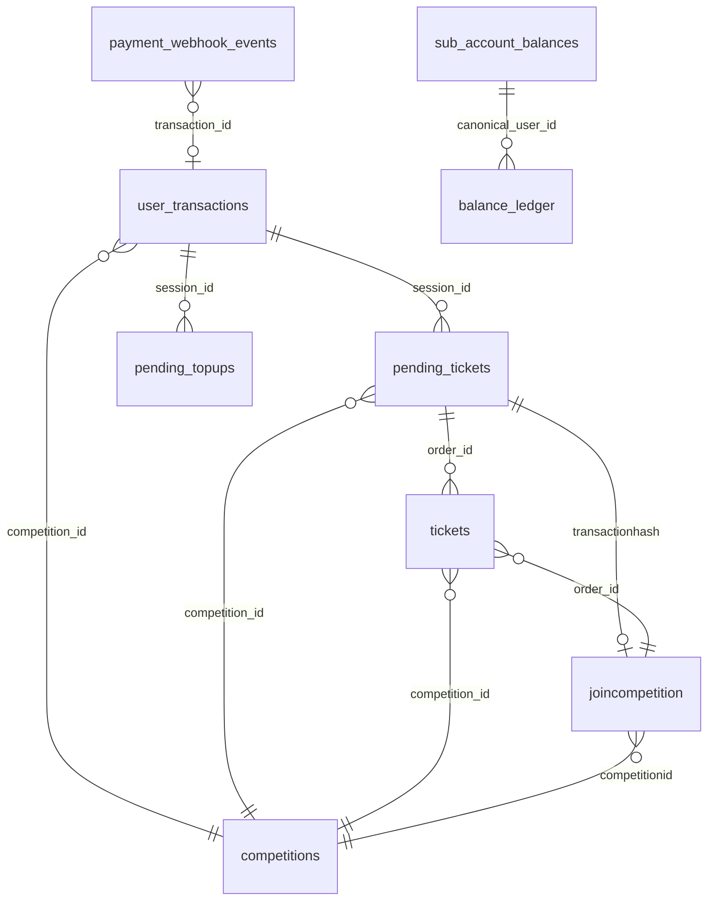

# Payment System Database Schema

**Last Updated:** January 20, 2026

---

## Table of Contents

1. [Core Tables](#core-tables)
2. [Relationships](#relationships)
3. [Key Indexes](#key-indexes)
4. [Database Functions (RPCs)](#database-functions-rpcs)
5. [Triggers](#triggers)

---

## Core Tables

### user_transactions

Central table tracking all payment transactions.

```sql
CREATE TABLE user_transactions (
  id UUID PRIMARY KEY DEFAULT gen_random_uuid(),
  
  -- User identification
  user_id TEXT NOT NULL,                    -- Canonical: prize:pid:0x...
  wallet_address TEXT,                      -- Normalized: 0x... (lowercase)
  
  -- Transaction details
  competition_id UUID,                      -- NULL for top-ups
  amount NUMERIC NOT NULL,
  currency TEXT NOT NULL DEFAULT 'USD',
  ticket_count INTEGER DEFAULT 0,
  
  -- Payment provider info
  payment_provider TEXT NOT NULL,           -- 'coinbase', 'privy_base_wallet', 'balance', etc.
  payment_method TEXT,                      -- Additional payment method details
  network TEXT,                             -- 'base', 'ethereum', etc.
  
  -- Transaction status
  status TEXT NOT NULL DEFAULT 'pending',   -- 'pending', 'processing', 'completed', 'failed', 'needs_reconciliation'
  payment_status TEXT,                      -- Provider-specific status
  
  -- External references
  tx_id TEXT,                               -- Blockchain tx hash OR Coinbase charge ID
  session_id TEXT,                          -- Payment session/charge code
  order_id TEXT,                            -- Order/reservation ID
  webhook_ref TEXT,                         -- Webhook correlation ID
  
  -- Balance tracking (for top-ups)
  wallet_credited BOOLEAN DEFAULT false,
  credit_synced BOOLEAN DEFAULT false,
  
  -- Timestamps
  created_at TIMESTAMP WITH TIME ZONE DEFAULT NOW(),
  updated_at TIMESTAMP WITH TIME ZONE DEFAULT NOW(),
  completed_at TIMESTAMP WITH TIME ZONE,
  
  -- Additional data
  notes TEXT,
  metadata JSONB,
  
  CONSTRAINT fk_competition FOREIGN KEY (competition_id) 
    REFERENCES competitions(id) ON DELETE SET NULL
);

-- Indexes
CREATE INDEX idx_user_transactions_user ON user_transactions(user_id);
CREATE INDEX idx_user_transactions_wallet ON user_transactions(wallet_address);
CREATE INDEX idx_user_transactions_competition ON user_transactions(competition_id);
CREATE INDEX idx_user_transactions_status ON user_transactions(status) WHERE status IN ('pending', 'processing');
CREATE INDEX idx_user_transactions_tx_id ON user_transactions(tx_id);
CREATE INDEX idx_user_transactions_session ON user_transactions(session_id);
CREATE INDEX idx_user_transactions_created ON user_transactions(created_at DESC);
```

### pending_tickets

Temporary ticket reservations before payment confirmation.

```sql
CREATE TABLE pending_tickets (
  id UUID PRIMARY KEY DEFAULT gen_random_uuid(),
  
  -- User identification
  user_id TEXT NOT NULL,
  canonical_user_id TEXT,
  
  -- Reservation details
  competition_id UUID NOT NULL,
  ticket_numbers INTEGER[] NOT NULL,        -- Array of reserved ticket numbers
  ticket_count INTEGER NOT NULL,
  ticket_price NUMERIC NOT NULL,
  total_amount NUMERIC NOT NULL,
  
  -- Status
  status TEXT NOT NULL DEFAULT 'pending',   -- 'pending', 'confirming', 'confirmed', 'expired', 'cancelled'
  
  -- Payment tracking
  session_id TEXT,                          -- Links to user_transactions.id
  payment_provider TEXT,
  transaction_hash TEXT,                    -- Final blockchain tx hash
  
  -- Expiration
  expires_at TIMESTAMP WITH TIME ZONE NOT NULL,
  confirmed_at TIMESTAMP WITH TIME ZONE,
  
  -- Timestamps
  created_at TIMESTAMP WITH TIME ZONE DEFAULT NOW(),
  updated_at TIMESTAMP WITH TIME ZONE DEFAULT NOW(),
  
  CONSTRAINT fk_competition FOREIGN KEY (competition_id) 
    REFERENCES competitions(id) ON DELETE CASCADE
);

-- Indexes
CREATE INDEX idx_pending_tickets_user ON pending_tickets(user_id);
CREATE INDEX idx_pending_tickets_competition ON pending_tickets(competition_id, status);
CREATE INDEX idx_pending_tickets_session ON pending_tickets(session_id);
CREATE INDEX idx_pending_tickets_expires ON pending_tickets(expires_at) WHERE status = 'pending';
CREATE INDEX idx_pending_tickets_status ON pending_tickets(status);

-- GIN index for array operations
CREATE INDEX idx_pending_tickets_numbers ON pending_tickets USING GIN (ticket_numbers);
```

### tickets

Individual ticket records after confirmation.

```sql
CREATE TABLE tickets (
  id UUID PRIMARY KEY DEFAULT gen_random_uuid(),
  
  -- Ticket identification
  competition_id UUID NOT NULL,
  ticket_number INTEGER NOT NULL,
  
  -- Owner
  user_id TEXT NOT NULL,                    -- Canonical: prize:pid:0x...
  
  -- Purchase tracking
  order_id TEXT,                            -- Links to pending_tickets.id or user_transactions.id
  purchase_date TIMESTAMP WITH TIME ZONE DEFAULT NOW(),
  
  -- Timestamps
  created_at TIMESTAMP WITH TIME ZONE DEFAULT NOW(),
  
  CONSTRAINT fk_competition FOREIGN KEY (competition_id) 
    REFERENCES competitions(id) ON DELETE CASCADE,
  
  -- Unique constraint: one ticket number per competition
  CONSTRAINT unique_ticket_number UNIQUE (competition_id, ticket_number)
);

-- Indexes
CREATE INDEX idx_tickets_user ON tickets(user_id);
CREATE INDEX idx_tickets_competition ON tickets(competition_id);
CREATE INDEX idx_tickets_order ON tickets(order_id);
CREATE INDEX idx_tickets_comp_number ON tickets(competition_id, ticket_number);
```

### joincompetition

Entry records summarizing ticket purchases.

```sql
CREATE TABLE joincompetition (
  uid UUID PRIMARY KEY DEFAULT gen_random_uuid(),
  
  -- Competition and user
  competitionid UUID NOT NULL,              -- Can be UUID or legacy UID
  userid TEXT NOT NULL,                     -- Canonical: prize:pid:0x...
  
  -- Entry details
  numberoftickets INTEGER NOT NULL,
  ticketnumbers TEXT NOT NULL,              -- Comma-separated: "1,5,10,42"
  amountspent NUMERIC NOT NULL,
  
  -- Payment tracking
  walletaddress TEXT,
  chain TEXT,                               -- Payment method: 'USDC', 'coinbase', 'balance'
  transactionhash TEXT NOT NULL,            -- Blockchain tx OR reservation ID
  
  -- Timestamps
  purchasedate TIMESTAMP WITH TIME ZONE DEFAULT NOW(),
  
  -- Metadata
  metadata JSONB
);

-- Indexes
CREATE INDEX idx_joincompetition_comp ON joincompetition(competitionid);
CREATE INDEX idx_joincompetition_user ON joincompetition(userid);
CREATE INDEX idx_joincompetition_txhash ON joincompetition(transactionhash);
CREATE INDEX idx_joincompetition_comp_user ON joincompetition(competitionid, userid);
```

### sub_account_balances

User balance tracking for site credits.

```sql
CREATE TABLE sub_account_balances (
  id UUID PRIMARY KEY DEFAULT gen_random_uuid(),
  
  -- User identification
  canonical_user_id TEXT NOT NULL,
  user_id TEXT NOT NULL,                    -- Duplicate for compatibility
  
  -- Balance
  available_balance NUMERIC NOT NULL DEFAULT 0,
  pending_balance NUMERIC NOT NULL DEFAULT 0,
  currency TEXT NOT NULL DEFAULT 'USD',
  
  -- Timestamps
  last_updated TIMESTAMP WITH TIME ZONE DEFAULT NOW(),
  created_at TIMESTAMP WITH TIME ZONE DEFAULT NOW(),
  
  -- Unique per user per currency
  CONSTRAINT unique_user_currency UNIQUE (canonical_user_id, currency)
);

-- Indexes
CREATE INDEX idx_sub_account_user ON sub_account_balances(canonical_user_id);
CREATE INDEX idx_sub_account_currency ON sub_account_balances(currency);
```

### balance_ledger

Audit trail for all balance changes.

```sql
CREATE TABLE balance_ledger (
  id UUID PRIMARY KEY DEFAULT gen_random_uuid(),
  
  -- User
  canonical_user_id TEXT NOT NULL,
  
  -- Transaction details
  transaction_type TEXT NOT NULL,           -- 'credit', 'debit', 'ticket_purchase', 'refund', etc.
  amount NUMERIC NOT NULL,                  -- Positive for credits, negative for debits
  currency TEXT NOT NULL DEFAULT 'USD',
  
  -- Balance snapshot
  balance_before NUMERIC NOT NULL,
  balance_after NUMERIC NOT NULL,
  
  -- Reference
  reference_id TEXT,                        -- Links to source transaction
  description TEXT,
  
  -- Metadata
  metadata JSONB,
  
  -- Timestamp
  created_at TIMESTAMP WITH TIME ZONE DEFAULT NOW()
);

-- Indexes
CREATE INDEX idx_balance_ledger_user ON balance_ledger(canonical_user_id);
CREATE INDEX idx_balance_ledger_created ON balance_ledger(created_at DESC);
CREATE INDEX idx_balance_ledger_type ON balance_ledger(transaction_type);
CREATE INDEX idx_balance_ledger_reference ON balance_ledger(reference_id);
```

### payment_webhook_events

Log of all webhook events received.

```sql
CREATE TABLE payment_webhook_events (
  id UUID PRIMARY KEY DEFAULT gen_random_uuid(),
  
  -- Provider
  provider TEXT NOT NULL,                   -- 'coinbase_commerce', 'onramp', 'offramp', etc.
  
  -- Event details
  event_type TEXT,                          -- 'charge:confirmed', 'onramp.success', etc.
  status INTEGER,                           -- HTTP status code of our response
  
  -- Extracted data
  charge_id TEXT,
  user_id TEXT,
  competition_id TEXT,
  transaction_id TEXT,
  
  -- Full payload
  payload JSONB NOT NULL,
  
  -- Timestamps
  webhook_received_at TIMESTAMP WITH TIME ZONE DEFAULT NOW(),
  created_at TIMESTAMP WITH TIME ZONE DEFAULT NOW()
);

-- Indexes
CREATE INDEX idx_webhook_events_provider ON payment_webhook_events(provider);
CREATE INDEX idx_webhook_events_type ON payment_webhook_events(event_type);
CREATE INDEX idx_webhook_events_charge ON payment_webhook_events(charge_id);
CREATE INDEX idx_webhook_events_user ON payment_webhook_events(user_id);
CREATE INDEX idx_webhook_events_transaction ON payment_webhook_events(transaction_id);
CREATE INDEX idx_webhook_events_created ON payment_webhook_events(created_at DESC);
```

### pending_topups

Temporary top-up records (optimistic crediting).

```sql
CREATE TABLE pending_topups (
  id UUID PRIMARY KEY DEFAULT gen_random_uuid(),
  
  -- User identification
  user_id TEXT NOT NULL,
  canonical_user_id TEXT NOT NULL,
  
  -- Top-up details
  amount NUMERIC NOT NULL,
  currency TEXT NOT NULL DEFAULT 'USD',
  
  -- Status
  status TEXT NOT NULL DEFAULT 'pending',   -- 'pending', 'confirmed', 'failed', 'expired'
  
  -- Payment tracking
  session_id TEXT NOT NULL,                 -- Links to user_transactions.id
  payment_provider TEXT,
  transaction_hash TEXT,
  
  -- Expiration
  expires_at TIMESTAMP WITH TIME ZONE NOT NULL,
  confirmed_at TIMESTAMP WITH TIME ZONE,
  
  -- Timestamps
  created_at TIMESTAMP WITH TIME ZONE DEFAULT NOW(),
  updated_at TIMESTAMP WITH TIME ZONE DEFAULT NOW()
);

-- Indexes
CREATE INDEX idx_pending_topups_user ON pending_topups(canonical_user_id);
CREATE INDEX idx_pending_topups_session ON pending_topups(session_id);
CREATE INDEX idx_pending_topups_status ON pending_topups(status);
CREATE INDEX idx_pending_topups_expires ON pending_topups(expires_at) WHERE status = 'pending';
```

---

## Relationships



---

## Key Indexes

### Performance Indexes

```sql
-- Fast user transaction lookups
CREATE INDEX idx_user_transactions_user_created 
  ON user_transactions(user_id, created_at DESC);

-- Fast competition ticket lookups
CREATE INDEX idx_tickets_comp_user 
  ON tickets(competition_id, user_id);

-- Fast availability checks
CREATE INDEX idx_pending_tickets_comp_status_expires 
  ON pending_tickets(competition_id, status, expires_at)
  WHERE status IN ('pending', 'confirming');

-- Fast webhook processing
CREATE INDEX idx_webhook_events_provider_created 
  ON payment_webhook_events(provider, created_at DESC);

-- Fast balance queries
CREATE INDEX idx_balance_ledger_user_created 
  ON balance_ledger(canonical_user_id, created_at DESC);
```

### Partial Indexes (for specific queries)

```sql
-- Only index active reservations
CREATE INDEX idx_pending_tickets_active 
  ON pending_tickets(competition_id, expires_at)
  WHERE status = 'pending';

-- Only index incomplete transactions
CREATE INDEX idx_user_transactions_incomplete 
  ON user_transactions(created_at)
  WHERE status NOT IN ('completed', 'failed');

-- Only index recent webhook events
CREATE INDEX idx_webhook_events_recent 
  ON payment_webhook_events(created_at DESC)
  WHERE created_at > NOW() - INTERVAL '7 days';
```

---

## Database Functions (RPCs)

### credit_sub_account_balance

Credits user's balance (for top-ups).

```sql
CREATE OR REPLACE FUNCTION credit_sub_account_balance(
  p_canonical_user_id TEXT,
  p_amount NUMERIC,
  p_currency TEXT DEFAULT 'USD'
)
RETURNS TABLE (
  success BOOLEAN,
  new_balance NUMERIC,
  error_message TEXT
)
LANGUAGE plpgsql
AS $$
DECLARE
  v_new_balance NUMERIC;
BEGIN
  -- Insert or update balance
  INSERT INTO sub_account_balances (
    canonical_user_id,
    user_id,
    available_balance,
    currency,
    last_updated
  ) VALUES (
    p_canonical_user_id,
    p_canonical_user_id,
    p_amount,
    p_currency,
    NOW()
  )
  ON CONFLICT (canonical_user_id, currency) DO UPDATE
  SET 
    available_balance = sub_account_balances.available_balance + p_amount,
    last_updated = NOW()
  RETURNING available_balance INTO v_new_balance;
  
  RETURN QUERY SELECT true, v_new_balance, NULL::TEXT;
EXCEPTION
  WHEN OTHERS THEN
    RETURN QUERY SELECT false, 0::NUMERIC, SQLERRM;
END;
$$;
```

### confirm_pending_to_sold

Atomically converts pending reservation to confirmed tickets.

```sql
CREATE OR REPLACE FUNCTION confirm_pending_to_sold(
  p_reservation_id UUID,
  p_transaction_hash TEXT,
  p_payment_provider TEXT,
  p_wallet_address TEXT
)
RETURNS JSONB
LANGUAGE plpgsql
AS $$
DECLARE
  v_reservation RECORD;
  v_ticket_count INTEGER;
BEGIN
  -- Lock reservation
  SELECT * INTO v_reservation
  FROM pending_tickets
  WHERE id = p_reservation_id
    AND status = 'pending'
  FOR UPDATE;
  
  IF NOT FOUND THEN
    -- Check if already confirmed
    SELECT * INTO v_reservation
    FROM pending_tickets
    WHERE id = p_reservation_id;
    
    IF v_reservation.status = 'confirmed' THEN
      RETURN jsonb_build_object(
        'success', true,
        'already_confirmed', true,
        'ticket_numbers', v_reservation.ticket_numbers
      );
    END IF;
    
    RETURN jsonb_build_object(
      'success', false,
      'error', 'Reservation not found or already processed'
    );
  END IF;
  
  -- Check expiration
  IF v_reservation.expires_at < NOW() THEN
    UPDATE pending_tickets SET status = 'expired' WHERE id = p_reservation_id;
    RETURN jsonb_build_object(
      'success', false,
      'error', 'Reservation has expired',
      'expired_at', v_reservation.expires_at
    );
  END IF;
  
  -- Update status to confirming
  UPDATE pending_tickets
  SET status = 'confirming', updated_at = NOW()
  WHERE id = p_reservation_id;
  
  -- Insert individual tickets
  INSERT INTO tickets (competition_id, user_id, ticket_number, order_id)
  SELECT 
    v_reservation.competition_id,
    v_reservation.user_id,
    unnest(v_reservation.ticket_numbers),
    p_reservation_id
  ON CONFLICT (competition_id, ticket_number) DO NOTHING
  RETURNING * INTO v_ticket_count;
  
  GET DIAGNOSTICS v_ticket_count = ROW_COUNT;
  
  -- Create joincompetition entry
  INSERT INTO joincompetition (
    uid,
    competitionid,
    userid,
    numberoftickets,
    ticketnumbers,
    amountspent,
    walletaddress,
    chain,
    transactionhash,
    purchasedate
  ) VALUES (
    gen_random_uuid(),
    v_reservation.competition_id,
    v_reservation.user_id,
    array_length(v_reservation.ticket_numbers, 1),
    array_to_string(v_reservation.ticket_numbers, ','),
    v_reservation.total_amount,
    p_wallet_address,
    p_payment_provider,
    p_transaction_hash,
    NOW()
  );
  
  -- Mark reservation as confirmed
  UPDATE pending_tickets
  SET 
    status = 'confirmed',
    confirmed_at = NOW(),
    transaction_hash = p_transaction_hash,
    updated_at = NOW()
  WHERE id = p_reservation_id;
  
  RETURN jsonb_build_object(
    'success', true,
    'tickets_inserted', v_ticket_count,
    'ticket_count', array_length(v_reservation.ticket_numbers, 1),
    'ticket_numbers', v_reservation.ticket_numbers
  );
EXCEPTION
  WHEN OTHERS THEN
    -- Rollback status change
    UPDATE pending_tickets
    SET status = 'pending', updated_at = NOW()
    WHERE id = p_reservation_id;
    
    RETURN jsonb_build_object(
      'success', false,
      'error', SQLERRM,
      'retryable', true
    );
END;
$$;
```

### confirm_ticket_purchase

Confirms tickets using balance payment (debits balance).

```sql
CREATE OR REPLACE FUNCTION confirm_ticket_purchase(
  p_pending_ticket_id UUID,
  p_payment_provider TEXT
)
RETURNS JSONB
LANGUAGE plpgsql
AS $$
DECLARE
  v_reservation RECORD;
  v_balance NUMERIC;
  v_new_balance NUMERIC;
BEGIN
  -- Lock reservation and balance
  SELECT * INTO v_reservation
  FROM pending_tickets
  WHERE id = p_pending_ticket_id
    AND status = 'pending'
  FOR UPDATE;
  
  IF NOT FOUND THEN
    RETURN jsonb_build_object('success', false, 'error', 'Reservation not found');
  END IF;
  
  -- Check expiration
  IF v_reservation.expires_at < NOW() THEN
    UPDATE pending_tickets SET status = 'expired' WHERE id = p_pending_ticket_id;
    RETURN jsonb_build_object('success', false, 'error', 'Reservation expired');
  END IF;
  
  -- Get and lock user balance
  SELECT available_balance INTO v_balance
  FROM sub_account_balances
  WHERE canonical_user_id = v_reservation.user_id
    AND currency = 'USD'
  FOR UPDATE;
  
  -- Check sufficient balance
  IF v_balance IS NULL OR v_balance < v_reservation.total_amount THEN
    RETURN jsonb_build_object(
      'success', false,
      'error', 'Insufficient balance',
      'required', v_reservation.total_amount,
      'available', COALESCE(v_balance, 0)
    );
  END IF;
  
  -- Debit balance
  v_new_balance := v_balance - v_reservation.total_amount;
  
  UPDATE sub_account_balances
  SET 
    available_balance = v_new_balance,
    last_updated = NOW()
  WHERE canonical_user_id = v_reservation.user_id
    AND currency = 'USD';
  
  -- Insert tickets
  INSERT INTO tickets (competition_id, user_id, ticket_number, order_id)
  SELECT 
    v_reservation.competition_id,
    v_reservation.user_id,
    unnest(v_reservation.ticket_numbers),
    v_reservation.id;
  
  -- Create joincompetition entry
  INSERT INTO joincompetition (
    uid, competitionid, userid, numberoftickets,
    ticketnumbers, amountspent, purchasedate,
    transactionhash, chain
  ) VALUES (
    gen_random_uuid(),
    v_reservation.competition_id,
    v_reservation.user_id,
    array_length(v_reservation.ticket_numbers, 1),
    array_to_string(v_reservation.ticket_numbers, ','),
    v_reservation.total_amount,
    NOW(),
    p_pending_ticket_id::TEXT,
    'balance'
  );
  
  -- Update reservation
  UPDATE pending_tickets
  SET status = 'confirmed', confirmed_at = NOW()
  WHERE id = p_pending_ticket_id;
  
  -- Record in ledger
  INSERT INTO balance_ledger (
    canonical_user_id, transaction_type, amount, currency,
    balance_before, balance_after, reference_id, description
  ) VALUES (
    v_reservation.user_id, 'ticket_purchase', -v_reservation.total_amount, 'USD',
    v_balance, v_new_balance, p_pending_ticket_id,
    format('Purchased %s tickets', array_length(v_reservation.ticket_numbers, 1))
  );
  
  RETURN jsonb_build_object(
    'success', true,
    'ticket_numbers', v_reservation.ticket_numbers,
    'new_balance', v_new_balance
  );
END;
$$;
```

---

## Triggers

### Auto-update timestamps

```sql
CREATE OR REPLACE FUNCTION update_updated_at_column()
RETURNS TRIGGER AS $$
BEGIN
  NEW.updated_at = NOW();
  RETURN NEW;
END;
$$ LANGUAGE plpgsql;

CREATE TRIGGER update_user_transactions_updated_at
  BEFORE UPDATE ON user_transactions
  FOR EACH ROW
  EXECUTE FUNCTION update_updated_at_column();

CREATE TRIGGER update_pending_tickets_updated_at
  BEFORE UPDATE ON pending_tickets
  FOR EACH ROW
  EXECUTE FUNCTION update_updated_at_column();

CREATE TRIGGER update_pending_topups_updated_at
  BEFORE UPDATE ON pending_topups
  FOR EACH ROW
  EXECUTE FUNCTION update_updated_at_column();
```

### Auto-expire reservations

```sql
CREATE OR REPLACE FUNCTION auto_expire_reservations()
RETURNS trigger AS $$
BEGIN
  -- Called on INSERT or UPDATE
  IF NEW.expires_at < NOW() AND NEW.status = 'pending' THEN
    NEW.status := 'expired';
  END IF;
  RETURN NEW;
END;
$$ LANGUAGE plpgsql;

CREATE TRIGGER check_reservation_expiry
  BEFORE INSERT OR UPDATE ON pending_tickets
  FOR EACH ROW
  EXECUTE FUNCTION auto_expire_reservations();
```

---

