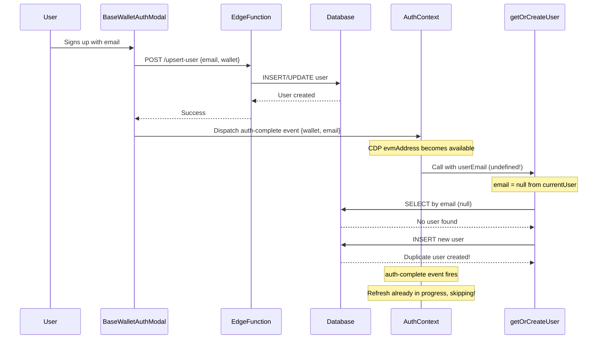

# User Duplication Fix - Technical Summary

## Problem Description

When users sign up via Base Wallet with email verification, duplicate user records were being created in the database:

1. **First Record**: Created by `upsert-user` edge function
   - Contains: email, wallet address, profile data
   - Created by: BaseWalletAuthModal calling the edge function
   - User ID: e.g., `704b59a6-fdbf-4723-9bdb-9cf8c10f9a97`

2. **Second Record**: Created by `getOrCreateUser` 
   - Contains: wallet address, but email = null
   - Created by: AuthContext after auth-complete
   - User ID: e.g., `55d7fa9e-7171-4505-8640-c86bbe0fba08`

## Root Cause Analysis

### Race Condition Flow



### Key Issues

1. **Email Not Available**: When `AuthContext.refreshUserData()` is triggered by wallet address becoming available, the `currentUser.email` is often not yet populated by the CDP SDK.

2. **Event Ignored**: The `auth-complete` event includes the correct email in `event.detail.email`, but `AuthContext` was ignoring it and only using `currentUser.email`.

3. **Race Condition**: The `upsert-user` edge function creates the user, but `getOrCreateUser` runs almost immediately and doesn't find it because:
   - Email lookup fails (email is null)
   - Wallet lookup might miss due to database replication lag
   - Canonical ID lookup might miss due to timing

## Solution Implemented

### Fix 1: Pass Email from auth-complete Event

**File**: `src/contexts/AuthContext.tsx`

**Change**: Modified `refreshUserData` to accept an optional `overrideEmail` parameter and use it in preference to `currentUser.email`:

```typescript
const refreshUserData = useCallback(async (overrideEmail?: string) => {
  // ...
  const effectiveEmail = overrideEmail || userEmail;
  
  const userForAuth = {
    id: effectiveWalletAddress,
    email: { address: effectiveEmail }, // Use effectiveEmail instead of userEmail
    // ...
  };
  
  const userProfile = await userAuth.getOrCreateUser(userForAuth);
  // ...
}, [effectiveWalletAddress, userEmail, fetchUserData, isCDPAuthenticated]);
```

**Change**: Modified `handleAuthComplete` to pass the email from the event:

```typescript
const handleAuthComplete = (event: CustomEvent) => {
  // ...
  if (event.detail?.walletAddress || effectiveWalletAddress) {
    void refreshUserData(event.detail?.email); // Pass email from event
  }
};
```

### Fix 2: Final Safety Check Before Creating User

**File**: `src/lib/user-auth.ts`

**Change**: Added a final check by wallet address in Step 5 before creating a new user:

```typescript
// STEP 5: Create new user (no existing account found)
console.log('[user-auth] Step 5: Creating new user with canonical ID');

// CRITICAL FIX: One final check by wallet address before creating a new user
if (walletAddress) {
  console.log('[user-auth] Step 5a: Final safety check by wallet address before creating');
  
  const { data: finalWalletCheckArray } = await supabase
    .from('canonical_users')
    .select('*')
    .or(`wallet_address.ilike.${walletAddress.toLowerCase()},base_wallet_address.ilike.${walletAddress.toLowerCase()},canonical_user_id.eq.${canonicalUserId}`)
    .order('created_at', { ascending: false })
    .limit(1);
  
  const finalWalletCheck = finalWalletCheckArray?.[0] || null;
  
  if (finalWalletCheck) {
    console.log('[user-auth] ✅ Found user in final safety check! Returning existing user instead of creating duplicate.');
    // Update and return existing user
    // ...
  }
}

// Only create if we still haven't found the user
const newUser = { /* ... */ };
```

## Expected Behavior After Fix

### New User Signup Flow

1. User fills form in NewAuthModal → data saved to `localStorage.pendingSignupData`
2. BaseWalletAuthModal reads pendingSignupData and calls `upsert-user` edge function
3. Edge function creates user with email, wallet, and profile data
4. BaseWalletAuthModal dispatches `auth-complete` event with `{walletAddress, email}`
5. AuthContext receives event and calls `refreshUserData(email)` with the email from the event
6. `getOrCreateUser` is called with the correct email
7. **Step 4**: Finds existing user by email ✅
8. **Returns existing user** - no duplicate created!

### Race Condition Handling

If `getOrCreateUser` runs before the edge function completes:

1. Steps 1-4 don't find the user
2. **Step 5a**: Final safety check by wallet address
3. Finds the user that was just created by edge function
4. Returns existing user - no duplicate created!

## Testing Instructions

### Manual Testing

1. **New User Signup**:
   ```
   1. Go to the app
   2. Click "Sign Up" 
   3. Fill in email and profile details
   4. Complete Base Wallet creation
   5. Check database: SELECT * FROM canonical_users WHERE email = '<your_email>'
   6. Should see ONLY ONE record with both email and wallet_address populated
   ```

2. **Check Console Logs**:
   ```javascript
   // Should see these logs in order:
   [BaseWallet] Calling upsert-user with form data: {email: ..., walletAddress: ...}
   [BaseWallet] User created successfully with wallet linked
   [AuthContext] Auth complete event received: {email: ..., walletAddress: ...}
   [AuthContext] refreshUserData called with: {overrideEmail: '...', source: 'auth-complete event'}
   [user-auth] Step 4: Looking up by email: <actual_email>
   [user-auth] ✅ Found existing user by EMAIL
   ```

3. **Database Verification**:
   ```sql
   -- Should return ONE user with matching email and wallet
   SELECT 
     id, 
     email, 
     wallet_address, 
     canonical_user_id,
     created_at
   FROM canonical_users 
   WHERE email = '<test_email>' 
   OR wallet_address = '<test_wallet>';
   ```

### What to Look For

✅ **Success Indicators**:
- Only ONE user record created per signup
- User record has both email and wallet_address populated
- Console shows "Found existing user by EMAIL" in Step 4
- No "Creating new user" message in Step 5

❌ **Failure Indicators**:
- Multiple user records with same email or wallet
- User record with wallet but email = null
- Console shows "Creating new user with canonical ID" 
- Console shows email = null or undefined in getOrCreateUser

## Related Files

- `src/contexts/AuthContext.tsx` - Auth state management, refreshUserData
- `src/lib/user-auth.ts` - User lookup and creation logic
- `src/components/BaseWalletAuthModal.tsx` - Wallet auth modal, dispatches auth-complete event
- `supabase/functions/upsert-user/index.ts` - Edge function for user creation

## Additional Notes

### Why Two Approaches?

1. **Email from Event** (Primary Fix): Ensures we always have the email when looking up users, preventing the lookup from failing.

2. **Final Safety Check** (Backup): Catches edge cases where:
   - Edge function completes but email is still not available
   - Database replication lag causes earlier lookups to miss
   - Concurrent requests create race conditions

Both fixes work together to ensure robust duplicate prevention.

### Database Constraints

The database has unique constraints on:
- `canonical_user_id`
- `email`

If a duplicate somehow gets through, the database will reject it with error code '23505', and we attempt to find and link the existing user.
